# Development and Evaluation of a Modular C++ Communication, Control, Visualization, and ROS Integration System for the DJI Tello Drone

**Course:** CS 500 Project  
**Student:** Gabriel Fernandes  
**Supervisor:** Prof. Stefan Bruda  
**Program Context:** Course-based M.Sc. project  
**Status:** Draft report with ROS2 integration  

## Abstract

This project develops and evaluates a modular C++ software stack for communicating with, monitoring, and controlling a DJI Tello drone. The system is built around a reusable core library that implements UDP-based SDK command execution, telemetry parsing, FFmpeg-based video streaming, runtime metrics, recovery behavior, and safety-oriented RC control. On top of the core library, the project provides command-line tools and a Qt-based Control Panel for live video, telemetry visualization, CSV logging, manual commands, and configurable keyboard-based flight control.

The implementation was evaluated using real-drone experiments covering command latency, telemetry freshness, FFmpeg video performance, GUI responsiveness, keyboard RC safety, power-cycle recovery, and Wi-Fi reconnect behavior. The final experiments show stable baseline command behavior, usable telemetry and video freshness, approximately 31-34 FPS FFmpeg video decoding, and measurable keyboard RC response across vertical, yaw, and attitude-proxy axes during flight. The project also includes a ROS2 integration layer that exposes the core library to robotics workflows through topics, services, command inputs, video messages, and an aggregate link-quality state.

## 1. Introduction

Small aerial robots are useful platforms for studying robotics software because they combine networking, telemetry, video streaming, control, safety, and user interaction in a compact system. The DJI Tello is especially suitable for a course project because it exposes a simple SDK over Wi-Fi while still presenting realistic engineering challenges: unreliable wireless links, UDP packet loss, command timeouts, asynchronous telemetry, video decoding, and safety-critical motion commands.

The goal of this CS 500 project is to define and initially develop a graduate-level applied robotics software problem: a modular C++ communication and control stack for the DJI Tello drone. The project focuses on a reusable core library rather than a one-off script. The software is designed to support multiple clients, including command-line tools, a desktop Control Panel, and a ROS2 bridge.

The main objectives are:

1. implement a reliable command channel over the Tello SDK;
2. parse and expose telemetry from the drone's state stream;
3. receive, decode, and display the video stream using FFmpeg;
4. collect runtime metrics suitable for experimental evaluation;
5. build a desktop Control Panel for operation and data collection;
6. implement configurable keyboard RC control with safety-oriented neutral behavior;
7. evaluate the system using repeatable real-drone experiments;
8. expose the system through a ROS2 integration layer.

## 2. DJI Tello SDK Background

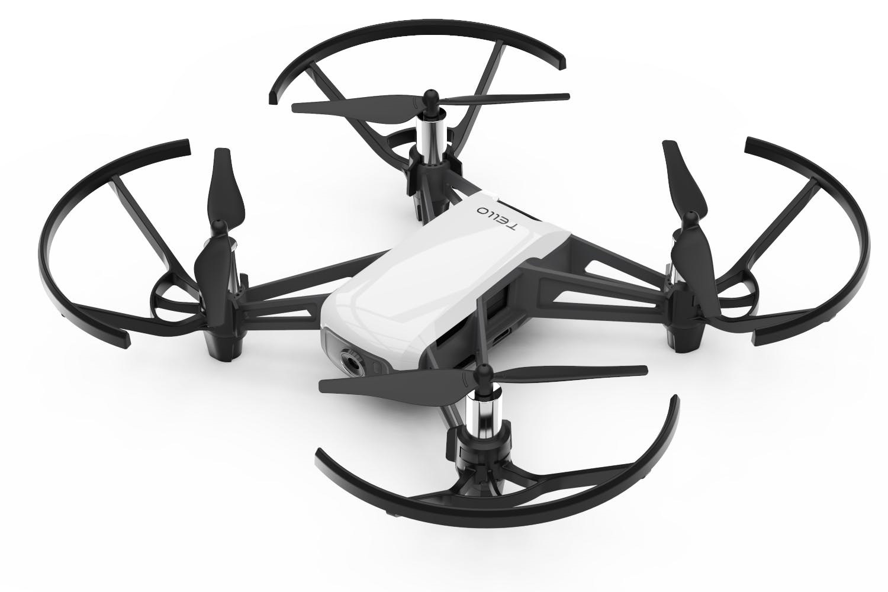

The DJI Tello SDK communicates over Wi-Fi using UDP. The host computer connects to the drone's Wi-Fi network and communicates with the drone at `192.168.10.1`. Three channels are central to this project:

| Channel | UDP Port | Direction | Purpose |
|---|---:|---|---|
| Command | `8889` | host to drone, drone to host | SDK commands and command responses |
| Telemetry | `8890` | drone to host | periodic state packets |
| Video | `11111` | drone to host | H264 video stream |

Before most SDK functionality is available, the host sends `command` to enter SDK mode. After that, command strings such as `battery?`, `takeoff`, `land`, `streamon`, and `streamoff` can be sent to the command port. Many SDK commands return a response such as `ok`, `error`, a numeric value, or no response before the client timeout expires. Because the protocol is UDP-based, software must be prepared for delayed, missing, or ambiguous responses.

The telemetry stream is different from the command channel. Once the drone is in SDK mode, it periodically sends state packets to the host. These packets include fields such as attitude, velocity, height, time-of-flight distance, battery, barometer, and temperature. Telemetry is not requested one packet at a time; it is received asynchronously by a background receiver.

The main telemetry fields used by this project are:

| Field | Meaning | Unit |
|---|---|---|
| `pitch` | pitch attitude | degrees |
| `roll` | roll attitude | degrees |
| `yaw` | yaw attitude | degrees |
| `vgx` | velocity along the SDK x-axis | cm/s |
| `vgy` | velocity along the SDK y-axis | cm/s |
| `vgz` | velocity along the SDK z-axis | cm/s |
| `templ` | lowest measured temperature | degrees Celsius |
| `temph` | highest measured temperature | degrees Celsius |
| `tof` | downward time-of-flight distance | cm |
| `h` | SDK-reported height | cm |
| `bat` | battery percentage | percent |
| `baro` | barometer-derived altitude measurement | cm |
| `time` | motor running time | seconds |
| `agx` | acceleration along the SDK x-axis | `0.001g` |
| `agy` | acceleration along the SDK y-axis | `0.001g` |
| `agz` | acceleration along the SDK z-axis | `0.001g` |

Three altitude-related fields are especially relevant for the flight analysis. `tof` is the time-of-flight distance in centimeters, measured by a downward distance sensor that estimates range from the time required for an emitted signal to reflect back to the drone. `h` is the SDK-reported height in centimeters. `baro` is a barometer-derived altitude measurement in centimeters, based on air pressure. In this project, `h` and `tof` are used to detect short vertical RC responses because they are easier to interpret over low-altitude indoor motion. `baro` is useful as a complementary trend signal but is not used alone for fine reaction-time estimates.

The video stream is enabled with `streamon` and disabled with `streamoff`. The drone sends H264 video over UDP port `11111`. In this project, FFmpeg opens the UDP stream directly, handles H264 parsing and decoding, and returns decoded RGB frames to the application.

The `rc a b c d` command is the SDK's continuous motion command. The four values represent:

1. `a`: left/right velocity command;
2. `b`: forward/back velocity command;
3. `c`: up/down velocity command;
4. `d`: yaw command.

Each value is typically in the range `-100` to `100`. A neutral command, `rc 0 0 0 0`, means no commanded motion. For safe manual control, software must return to neutral when no key or joystick input is active.

## 3. System Architecture

The project is centered on a reusable C++ core library that contains the drone-specific communication and processing logic. Applications such as the CLI tools and Qt Control Panel depend on this library instead of duplicating SDK, telemetry, video, and recovery behavior.

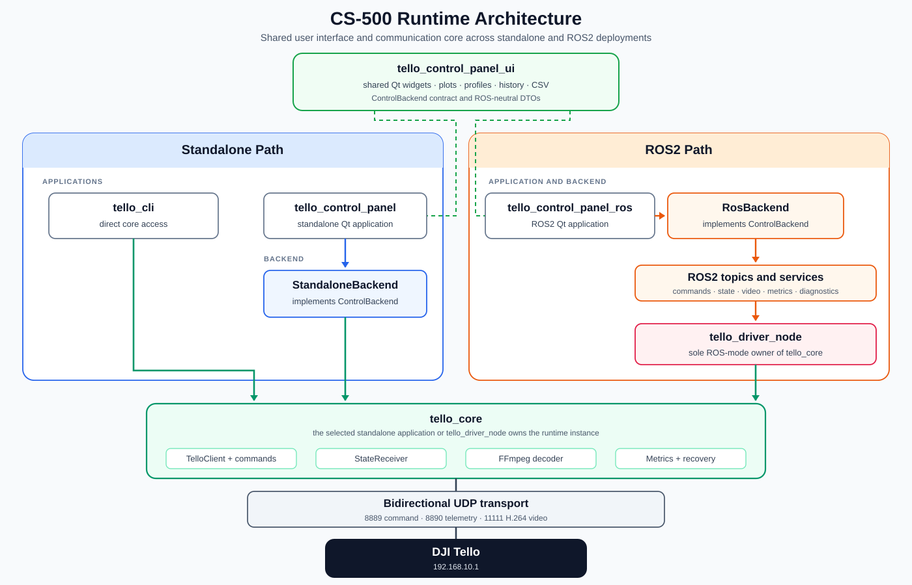

The diagram shows the main project boundary: the drone communicates over the SDK UDP channels, `tello_core` owns the reusable communication and processing logic, and each client uses that same core layer instead of reimplementing drone-specific behavior.

The main components are:

- `UdpSocket`: low-level UDP send/receive abstraction.
- `CommandExecutor`: command send/receive policy with timeout and retry behavior.
- `TelloClient`: high-level drone API, SDK session state, keepalive, and recovery behavior.
- `StateParser`: parser for raw Tello state strings.
- `StateReceiver`: background telemetry receiver and thread-safe latest-state cache.
- `VideoStreamReaderFfmpeg`: FFmpeg Stream reader for H264 video over UDP.
- `MetricsCollector`: central runtime metrics aggregator and CSV export schema.
- CLI applications: smoke commands, command watch, state watch, and video watch.
- Qt Control Panel: graphical operation, visualization, keyboard control, and CSV export.

The architecture separates transport, parsing, client state, metrics, and user interface. This also supports ROS2 integration, where the ROS layer wraps the core library instead of reimplementing the command, telemetry, video, and safety logic.

## 4. Implementation

### 4.1 Command Channel

The command channel uses UDP to send SDK commands to the drone and wait for responses for synchronous SDK operations. Reliability is handled in layers. `UdpSocket` provides transport operations and timeout handling. `CommandExecutor` handles command execution policy, including retry and timeout behavior. `TelloClient` owns higher-level SDK state and exposes methods such as SDK entry, takeoff, land, stream control, keepalive, and recovery. 

The client tracks connection state through connected, recovering, and disconnected states. It also exposes connection events such as lost, restored, and transient loss recovered, which are useful for experiments and logging. A keepalive loop can periodically send `battery?` queries to keep the SDK session active when no RC stream is running. This is necessary because the Tello SDK states that if the drone receives no command for 15 seconds, it automatically lands. During idle experiments, periodic lightweight commands prevent the drone from treating the session as inactive while avoiding unnecessary motion commands.

Several command-channel details were refined during real-drone testing. Critical commands such as `takeoff` and `land` are protected by preflight neutral RC behavior. RC commands use a no-wait path so continuous control does not wait behind slow query commands. In the Qt Control Panel, blocking critical commands and stream-control commands are dispatched through a background command worker; the GUI receives the final result through a queued callback and remains responsive while the command is waiting for an SDK response or timeout. Metrics include command latency, failures, command mutex wait time, command source, raw attempt logs, internal attempt logs, recovery timing, and connection state.

An important refinement was the distinction between a real connection loss and a transient command outage that recovers inside the same high-level API call. Earlier logs could report `LOST` as soon as one internal SDK command attempt timed out, even if retry or recovery succeeded and the public API call returned `OK`. The client now records the full `command_internal_attempt_log`, including all executor calls and recovery calls made inside one high-level command. If at least one internal attempt failed but the final command result is `OK`, the event is classified as `TRANSIENT_LOSS_RECOVERED` instead of a persistent loss. This produces a more accurate operator and experiment log.

### 4.2 Telemetry

Telemetry is received from the Tello state channel on UDP port `8890`. `StateReceiver` runs a background receive loop, parses each packet with `StateParser`, and stores the latest valid state. Consumers access telemetry through a thread-safe latest-state cache.

The project records both wall-clock timestamps and monotonic elapsed timestamps. For analysis, monotonic elapsed time is preferred because it avoids false gaps caused by wall-clock adjustments. Telemetry metrics include receive rate, packet age, interarrival gaps, quality labels, and selected state fields such as height, time-of-flight, battery, temperature, yaw, and vertical velocity.

### 4.3 Video Pipeline

The video pipeline uses FFmpeg Stream as the only supported runtime path. The drone sends H264 video over UDP after `streamon`. `VideoStreamReaderFfmpeg` opens:

```text
udp://@0.0.0.0:11111?overrun_nonfatal=1&fifo_size=5000000
```

FFmpeg handles UDP stream reading, H264 parsing, decoding, and frame timing internally. The application receives decoded RGB frames and displays them in the Qt Control Panel. This design was selected because it produced smoother live video during real flight operation and avoids maintaining a second custom H264 packet assembly path.

The video metrics include packets read, bytes read, latest frame age, decoded frames, decode FPS, decode errors, frame size, keyframes, and UI frame conversion/display counters. The same video path is used by both the CLI video experiment and the Control Panel.

### 4.4 Metrics and Experiment Logging

`MetricsCollector` centralizes runtime metrics across command, telemetry, video, GUI, recovery, and control behavior. CSV rows include experiment metadata followed by metrics groups for:

1. command latency and failures;
2. telemetry counters and freshness;
3. video packet/decode behavior;
4. frame size and decoder FPS;
5. recovery status;
6. GUI timing;
7. RC stream state and values;
8. keepalive state;
9. event/log messages.

The word "quality" in the experiment results means transport freshness and continuity. It does not mean subjective image sharpness, scene visibility, or flight-control accuracy. The labels are computed from packet age and interarrival timing:

| Label | Meaning |
|---|---|
| `NO_DATA` | no packet has been received |
| `OK` | latest packet age is at most 200 ms and interarrival is at most 300 ms |
| `DEGRADED` | latest packet age is at most 500 ms and interarrival is at most 500 ms |
| `STALE` | data is too old for safe control assumptions |

These labels are intended to support future closed-loop control decisions. `OK` means the stream is fresh enough for normal monitoring. `DEGRADED` suggests caution. `STALE` and `NO_DATA` should be treated as unsafe for feedback control.

Packet age and packet interarrival measure different aspects of the stream. Packet age is how old the most recent packet is at the moment a metrics row is written. If no new packet arrives, age increases. Packet interarrival is the elapsed time between two consecutive received packets. A stream can have regular interarrival while packets are flowing, but high age after packets stop arriving.

### 4.5 Qt Control Panel

The Qt Control Panel is the main human-facing application. It has a global control area above the tabs, followed by Config and Operation tabs. The annotated screenshots below show the corresponding interface areas; the numbered descriptions are intended to match those figures.

#### Global Controls Above The Tabs

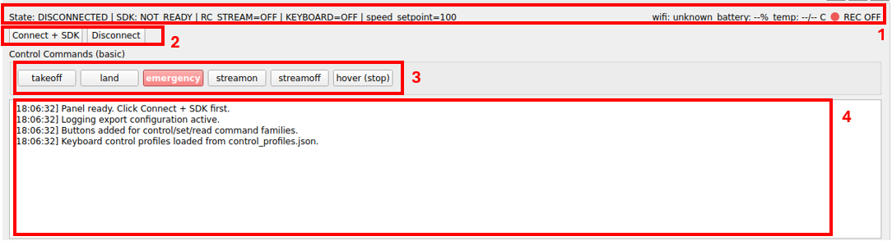

1. **Top Status Row:** summarizes connection state, SDK readiness, RC stream state, keyboard-control state, speed setpoint, aggregate link quality, Wi-Fi status, battery, temperature, and state-recording status.
2. **Connection Controls:** provide `Connect + SDK` and `Disconnect` actions. `Connect + SDK` initializes the command channel, enters SDK mode, starts telemetry reception, and starts SDK keepalive when appropriate.
3. **Basic Flight Controls:** expose high-priority commands such as `takeoff`, `land`, `emergency`, `streamon`, `streamoff`, and hover/stop. `takeoff` requires confirmation, `emergency` is visually emphasized, and blocking critical commands are executed by a background command worker so the GUI event loop does not wait for SDK timeouts.
4. **Log Panel:** records user-visible events, command responses, recovery events, and state transitions. The same log messages can also be stored in the GUI metrics CSV for experiment correlation.

#### Config Tab Features

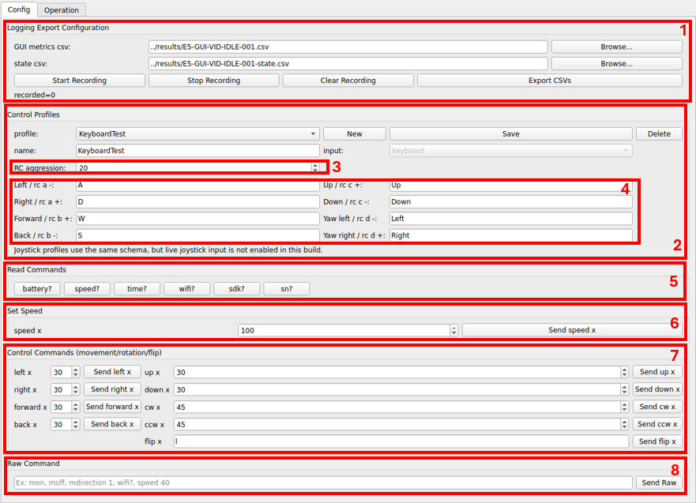

1. **Logging Export Configuration:** selects GUI metrics and state CSV paths, starts/stops recording, clears buffered recordings, and exports both CSV files.
2. **Control Profiles:** creates, edits, saves, and deletes keyboard control profiles while preserving at least one default profile.
3. **RC Aggression:** defines the absolute RC magnitude used by mapped keyboard movements.
4. **Input Mapping:** maps keys to left, right, forward, back, up, down, yaw left, and yaw right actions.
5. **SDK Read Commands:** provides quick buttons for query commands such as `battery?`, `speed?`, `time?`, `wifi?`, `sdk?`, and `sn?`.
6. **Set Speed:** sends `speed x`, with the default setpoint initialized to `100`.
7. **Movement, Rotation, and Flip Commands:** exposes parameterized commands such as `up x`, `down x`, `left x`, `right x`, `forward x`, `back x`, `cw x`, `ccw x`, and `flip x`.
8. **Raw Command:** allows manually sending an SDK command string for testing or diagnostics.

#### Operation Tab Features

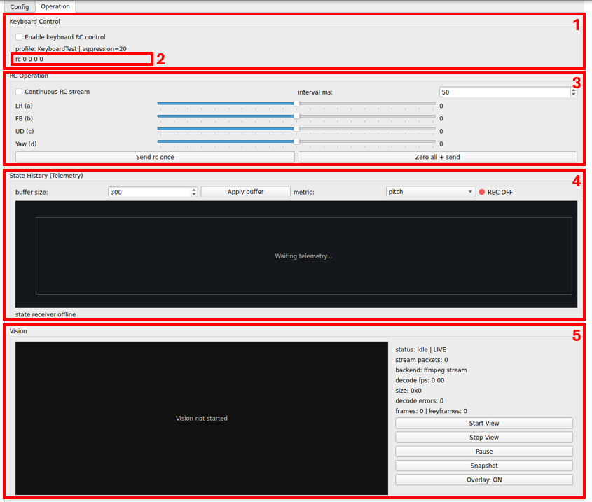

1. **Keyboard Control:** enables/disables keyboard RC control and shows the active profile and current RC vector.
2. **Dedicated RC Worker:** sends the desired RC command independently from the GUI event loop and falls back to neutral if input becomes stale.
3. **Manual RC Operation:** provides sliders for left/right, forward/back, up/down, and yaw, plus one-shot RC, zero-and-send, and continuous RC stream controls.
4. **State History:** displays telemetry history, selected state plots, buffer size, recording status, and a red/green REC indicator.
5. **Vision:** starts/stops FFmpeg Stream viewing, pauses live display, captures snapshots, and toggles the overlay.

The Control Panel also records user-visible logs into the metrics CSV, allowing post-run analysis to correlate GUI events with telemetry, video, and command behavior. On application close or Ctrl+C, the panel sends `emergency` if the drone is connected.

### 4.6 Keyboard RC Control

Keyboard RC control was implemented using configurable control profiles. A profile maps keyboard inputs to RC axes and defines a single aggression value used for all mapped movement commands. Profiles are stored persistently and can be edited in the Control Panel.

The initial concern during flight testing was that GUI stalls could cause a movement command to remain active after the user released the key. To mitigate this, RC sending was moved into a dedicated worker. The GUI updates a desired RC state, while the worker sends RC commands at a fixed cadence. If input becomes stale, the worker sends neutral RC. This design reduces coupling between GUI event-loop responsiveness and drone motion safety.

### 4.7 ROS2 Integration

ROS, the Robot Operating System, is a common middleware framework used in robotics to connect sensors, controllers, planning algorithms, visualization tools, and hardware drivers. Despite its name, ROS is not an operating system in the traditional kernel sense. It provides conventions and libraries for building distributed robot software. In ROS2, independent processes called nodes communicate through typed topics, request/response services, actions, parameters, launch files, and a DDS-based discovery and transport layer. A typical robotics system uses a hardware driver node to publish sensor data and accept commands, while other nodes perform mapping, planning, control, visualization, or logging. Tools such as `ros2 topic echo`, `ros2 service call`, `rqt`, and RViz are then used to inspect and interact with the running graph.

The project now includes a separate ROS2 Jazzy integration workspace. It is intentionally separate from the academic project workspace so that the ROS package remains small and runtime-oriented. Documentation, notebooks, experiment results, planning files, and report material are not copied into the ROS package. Instead, the C++ runtime is packaged as a versioned `tello_core` release artifact containing only the installed library, public headers, CLI executable, Qt Control Panel executable, CMake package metadata, and required runtime resources. The ROS workspace consumes that artifact through a `tello_core_vendor` package, which can download a fixed release or install from a local `.tar.gz` file during `colcon build`.

The ROS workspace is organized into four packages:

1. `tello_core_vendor`, which finds or installs the fixed `tello_core` runtime release;
2. `tello_interfaces`, which defines Tello-specific messages and services;
3. `tello_driver`, which implements the broker node that owns the drone command channel;
4. `tello_bringup`, which provides launch files for starting the driver and GUI together.

The dependency on the CS 500 core repository is therefore release-based rather than source-tree-based. The ROS workspace does not need to clone or carry the full academic repository. During development, the vendor package can consume a local release artifact:

```bash
colcon build --cmake-clean-cache --cmake-args \
  -DTELLO_CORE_VERSION=1.0.0 \
  -DTELLO_CORE_VENDOR_FORCE_DOWNLOAD=ON \
  -DTELLO_CORE_RELEASE_URL=file:///home/gabriel_fernandes/CS%20500/tello_core-1.0.0-Linux-x86_64.tar.gz
```

For a published GitHub release, the same package can construct the artifact URL from a version and base release path:

```bash
colcon build --cmake-args \
  -DTELLO_CORE_VERSION=1.0.0 \
  -DTELLO_CORE_RELEASE_BASE_URL=https://github.com/Gfernandes10/CS-500/releases/download
```

After the ROS workspace is built, the application is launched by sourcing ROS2 Jazzy and the workspace install tree, then running the bringup launch file:

```bash
source /opt/ros/jazzy/setup.bash
source install/setup.bash
ros2 launch tello_bringup control_panel.launch.py
```

This starts both `/tello/tello_driver_node` and the Qt Control Panel in ROS mode. The graph can be inspected with standard ROS tools:

```bash
ros2 node list
ros2 topic list
ros2 service list
ros2 topic echo /tello/link_quality
```

The central ROS node is `tello_driver_node`. It is the only ROS-mode process that owns the `TelloClient` and therefore the only process that talks directly to the drone command UDP socket. This ownership model avoids conflicting command senders. The node subscribes to `/tello/cmd_vel` using `geometry_msgs/Twist`, clamps normalized command values to `[-1.0, 1.0]`, scales them to SDK RC values in `[-100, 100]`, and maps them to the Tello command `rc a b c d` as follows: `linear.y` to left/right, `linear.x` to forward/back, `linear.z` to up/down, and `angular.z` to yaw.

The ROS interface is summarized below so that the delivered bridge can be inspected with standard ROS tools.

| Interface | Direction | Type | Purpose |
|---|---|---|---|
| `/tello/state` | published by driver | `tello_interfaces/msg/TelloState` | structured telemetry from the SDK state channel |
| `/tello/battery` | published by driver | `std_msgs/msg/Int32` | convenience battery percentage topic |
| `/tello/connection_state` | published by driver | `std_msgs/msg/String` | SDK connection state for operators and tools |
| `/tello/link_quality` | published by driver | `tello_interfaces/msg/LinkQuality` | aggregate communication-quality and RC-safety state |
| `/tello/video/image_raw` | published by driver | `sensor_msgs/msg/Image` | decoded FFmpeg video frames |
| `/tello/diagnostics` | published by driver | `diagnostic_msgs/msg/DiagnosticArray` | diagnostic status for ROS tooling |
| `/tello/cmd_vel` | subscribed by driver | `geometry_msgs/msg/Twist` | normalized autonomous velocity command input |
| `/tello/manual_cmd_vel` | published by Control Panel in ROS mode | `geometry_msgs/msg/Twist` | manual RC input forwarded through the ROS command owner |

The main services exposed by the driver are:

| Service | Type | Purpose |
|---|---|---|
| `/tello/connect` | `std_srvs/srv/Trigger` | initialize the core client and enter SDK mode |
| `/tello/disconnect` | `std_srvs/srv/Trigger` | stop operation and release the SDK session |
| `/tello/takeoff` | `std_srvs/srv/Trigger` | request takeoff through the ROS command owner |
| `/tello/land` | `std_srvs/srv/Trigger` | request landing through the ROS command owner |
| `/tello/emergency` | `std_srvs/srv/Trigger` | request emergency motor stop |
| `/tello/streamon` | `std_srvs/srv/Trigger` | enable video streaming |
| `/tello/streamoff` | `std_srvs/srv/Trigger` | disable video streaming |
| `/tello/enable_autonomy` | `std_srvs/srv/Trigger` | allow `/tello/cmd_vel` to control the drone |
| `/tello/disable_autonomy` | `std_srvs/srv/Trigger` | block autonomous command input |
| `/tello/gui_command` | `tello_interfaces/srv/Command` | forward a GUI-requested SDK command through the broker |

The link-quality topic exposes the same aggregate safety-oriented state introduced in the core metrics layer. It includes the overall label, numeric score, `safe_for_nonzero_rc`, reason text, telemetry/video/command/RC sublabels, and RC cadence diagnostics. This makes communication health visible to future ROS controllers rather than only to the Qt Control Panel or CSV logs.

The driver also exposes services for connect, disconnect, takeoff, land, emergency, stream on, stream off, enabling autonomy, disabling autonomy, and forwarding GUI commands. Command arbitration is deliberately conservative. `/tello/cmd_vel` is accepted only when autonomy is explicitly enabled. Commands originating from the GUI or manual services switch the driver into manual override, block `/tello/cmd_vel`, and execute the requested GUI or service command through the broker. Discrete critical commands such as takeoff, land, emergency, stream on, and stream off can preempt autonomous command flow. Manual RC commands from the GUI are forwarded directly as RC commands and continue to block autonomous `/cmd_vel` until autonomy is explicitly re-enabled. The emergency service has highest priority.

The Qt Control Panel is preserved as the main graphical application. In standalone mode it can still communicate directly with the drone for development. In ROS mode it is launched with `tello_control_panel --ros-mode` and does not own the UDP command channel. Instead, it consumes `/tello/state`, `/tello/battery`, `/tello/connection_state`, `/tello/link_quality`, and `/tello/video/image_raw` from the ROS driver, publishes manual RC input on `/tello/manual_cmd_vel`, and uses ROS services for discrete commands such as connect, takeoff, land, emergency, stream on, and stream off. The launch file `control_panel.launch.py` starts both the broker node and the GUI, producing a single user-facing control panel while keeping command ownership inside ROS.

The ROS launch path was also validated in basic real-drone operation. In this validation, the bringup launch started the driver and Control Panel, the GUI connected to the drone through `/tello/connect`, telemetry and video were visible through the ROS-mode GUI, and the ROS topics and services were available for external inspection and tooling.

### 4.8 Standalone Build And Operation

The core API can also be used without ROS. In standalone mode, the CLI tools and Qt Control Panel link directly against `tello_core` and communicate with the drone through the SDK UDP channels. This is the mode used for the real-drone experiments in this report.

For users who want to consume the API as a dependency, the preferred distribution path is the versioned release artifact rather than a direct build from the academic source tree. A release contains only the runtime-facing files: public headers, the compiled library, CMake package metadata, runtime resources, and the CLI/Control Panel executables. This allows another C++ or ROS project to depend on a fixed `tello_core` version without copying documentation, notebooks, experiment results, or planning files.

A user can obtain a specific version from the project releases page. For example, version `1.0.0` can be downloaded and extracted as follows:

```bash
mkdir -p $HOME/tello_core_releases
curl -L \
  -o /tmp/tello_core-1.0.0-Linux-x86_64.tar.gz \
  https://github.com/Gfernandes10/CS-500/releases/download/v1.0.0/tello_core-1.0.0-Linux-x86_64.tar.gz
tar -xzf /tmp/tello_core-1.0.0-Linux-x86_64.tar.gz \
  -C $HOME/tello_core_releases
```

After extraction, the release directory can be used as an installation prefix:

```bash
export TELLO_CORE_PREFIX=$HOME/tello_core_releases/tello_core-1.0.0-Linux-x86_64
export PATH=$TELLO_CORE_PREFIX/bin:$PATH
export CMAKE_PREFIX_PATH=$TELLO_CORE_PREFIX:$CMAKE_PREFIX_PATH
```

The command-line tool and Control Panel can then be launched directly from the versioned release:

```bash
tello_cli --once
tello_control_panel
```

A downstream CMake project can consume an installed or extracted release through the exported package:

```cmake
find_package(tello_core REQUIRED)
target_link_libraries(my_app PRIVATE tello_core::tello_core)
```

The source-based standalone workflow remains useful for development, auditing, project evaluation, or rebuilding on a different machine. In that case, clone the repository:

```bash
git clone https://github.com/Gfernandes10/CS-500.git
cd CS-500
```

On Ubuntu or Debian, install the required development packages:

```bash
sudo apt update
sudo apt install -y \
  build-essential \
  cmake \
  pkg-config \
  libavformat-dev \
  libavcodec-dev \
  libavutil-dev \
  libswscale-dev \
  qtbase5-dev
```

FFmpeg is required because the project supports only the FFmpeg Stream video path. Qt is required for the graphical Control Panel. OpenCV is optional and is not the primary video runtime path:

```bash
sudo apt install -y libopencv-dev
```

Build the standalone core, CLI, and Control Panel:

```bash
cmake -S tello_core -B build/tello_core_standalone

cmake --build build/tello_core_standalone
```

Prebuilt binaries are not assumed to be portable across machines because they depend on the Linux distribution, CPU architecture, compiler, FFmpeg, Qt, and runtime library versions. For distribution, prebuilt binaries should be published separately as release artifacts rather than committed directly to the source repository.

The offline tests can be run without a drone:

```bash
ctest --test-dir build/tello_core_standalone \
  -L offline \
  --output-on-failure
```

For a basic hardware check, power on the Tello, connect the computer to the Tello Wi-Fi network, wait about 10-15 seconds after power-on, and run:

```bash
./build/tello_core_standalone/tello_cli --once
```

For the standalone graphical application, run:

```bash
./build/tello_core_standalone/tello_control_panel
```

The normal standalone Control Panel workflow is:

1. power on the drone;
2. connect the computer to the Tello Wi-Fi network;
3. start `tello_control_panel`;
4. press `Connect + SDK`;
5. confirm that telemetry, battery, temperature, link quality, and video status update;
6. configure CSV export paths if experiment logging is needed;
7. use the Config tab for SDK commands, speed setting, and keyboard profile setup;
8. use the Operation tab for live video, state history, manual RC sliders, and keyboard RC control.

In standalone mode the Control Panel owns the command channel directly. If ROS mode is required, the Control Panel should instead be launched through the ROS bringup flow so that the ROS driver node owns the command channel.

## 5. Milestone Plan Traceability

The original milestone plan divided the project into eight phases. This section maps each planned phase to the delivered implementation, the evidence currently available in the report, and any remaining evidence that should be added before the final submission.

An accompanying continuous evidence video will be linked here after upload: [CS 500 evidence video placeholder](https://youtu.be/REPLACE_WITH_FINAL_EVIDENCE_VIDEO). The video demonstrates the delivered artifacts for Phases 0, 1, 2, 3, 5, and 6. Phase 4 is evidenced primarily by the experimental methodology, CSV-based measurements, and quantitative results in this report. Phase 7 is evidenced by the final report and presentation artifacts themselves.

### 5.1 Phase 0: Project Definition and Architecture

**Planned goal.** Phase 0 was intended to define the project scope, study the DJI Tello SDK, choose technologies, create the source structure, define the core modules, and establish the CMake build system.

**Delivered work.** This phase was delivered. The project scope was defined around a modular C++ Tello communication stack. The architecture separates command, telemetry, video, metrics, GUI, and ROS integration. The implementation uses C++17, CMake, FFmpeg, Qt, and ROS2 Jazzy. The actual source organization evolved from the initial conceptual folders into a reusable `tello_core` package plus a separate ROS2 workspace that consumes a packaged runtime artifact. This preserves the planned modular boundary while keeping academic material, experiments, and reports outside the ROS runtime package.

**Evidence included.** The SDK background, system architecture, component descriptions, and implementation sections document the final structure and design decisions. Section 3 includes the final system architecture diagram, showing the DJI Tello drone, UDP command/telemetry/video channels, the reusable `tello_core` layer, CLI tools, Qt Control Panel, metrics layer, and ROS2 bridge. The accompanying evidence video shows the SDK background, architecture diagram, and project structure.

### 5.2 Phase 1: Core Networking and Command Layer

**Planned goal.** Phase 1 was intended to implement UDP communication, command execution, timeout and retry behavior, logging, and a CLI tool for command testing.

**Delivered work.** This phase was delivered. `UdpSocket`, `CommandExecutor`, and `TelloClient` implement the command channel. The command socket was refined to use the SDK command port consistently and avoid ambiguous response ownership. The CLI supports one-shot commands, command watching, SDK initialization, keepalive, command metrics, and recovery state reporting. Logging is integrated through a console logger and GUI log export.

**Evidence included.** The smoke test and command baseline in the experimental results section validate this phase with real-drone command latency, timeout, retry, and transient-recovery measurements. The packet-capture discussion provides additional evidence that periodic command delays were transport/drone-response events rather than local API parsing or GUI blocking. The accompanying evidence video shows CLI command execution and metrics CSV generation.

### 5.3 Phase 2: Telemetry System

**Planned goal.** Phase 2 was intended to implement continuous telemetry reception, parse raw state messages into structured data, provide thread-safe access, and record telemetry logs.

**Delivered work.** This phase was delivered. `StateParser` converts raw SDK state strings into structured telemetry. `StateReceiver` runs a background receiver, stores the latest state, buffers recent history, records state CSV data, and exposes thread-safe access to consumers.

**Evidence included.** The telemetry baseline, GUI baseline, and keyboard-flight runs validate packet freshness, packet age, interarrival gaps, state recording, and quality labels. Parser behavior is also covered by unit tests. The accompanying evidence video shows live telemetry reception, parsed state values, state plotting, and state CSV recording.


### 5.4 Phase 3: Video Stream Integration

**Planned goal.** Phase 3 was intended to receive, decode, and expose the drone video stream, including a minimal viewer or frame access path.

**Delivered work.** This phase was delivered with a design refinement. The final video implementation uses `VideoStreamReaderFfmpeg`, which opens the Tello H264 UDP stream directly through FFmpeg, decodes frames, converts them to RGB, and feeds both CLI metrics and the Qt Control Panel. FFmpeg Stream became the only supported video runtime path because it produced smoother real-flight video and reduced implementation risk.

**Evidence included.** The video baseline, GUI idle run, and keyboard-flight run validate decoded frame rate, video freshness, decoder stability, and GUI display behavior. The accompanying evidence video shows the FFmpeg Stream video path running in the Qt Control Panel.

### 5.5 Phase 4: Evaluation and Metrics

**Planned goal.** Phase 4 was intended to add command latency, telemetry rate, video FPS, timestamp logging, metadata-ready CSV exports, experiments, plots, and performance analysis.

**Delivered work.** This phase was delivered and became one of the central contributions of the project. `MetricsCollector` centralizes command, telemetry, video, GUI, keepalive, recovery, link-quality, and RC metrics. Experiments record metadata such as test ID, scenario, notes, and run mode.

**Evidence included.** The final experiment set covers command behavior, telemetry continuity, FFmpeg video, GUI operation, keyboard RC flight, power-cycle recovery, and Wi-Fi reconnect behavior. The Results section includes plots and quantitative summaries generated from these experiments. This phase is evidenced by the experimental methodology, recorded CSV files, generated figures, and analysis presented in the Results section rather than by a separate live demonstration.

### 5.6 Phase 5: ROS Integration

**Planned goal.** Phase 5 was intended to create a ROS2 package, wrap the core library in a ROS node, publish telemetry and camera data, subscribe to velocity commands, expose takeoff and landing services, and test the bridge with ROS tools. The plan named ROS2 Humble or a compatible ROS2 version; the delivered implementation uses ROS2 Jazzy.

**Delivered work.** This phase was delivered as a separate ROS2 Jazzy workspace. The ROS implementation keeps the ROS layer thin by depending on an installed `tello_core` runtime artifact rather than copying the full academic source tree, documentation, notebooks, experiment results, or planning files into the ROS repository. The workspace includes a vendor package for the core runtime, custom Tello interfaces, a driver node, and bringup launch files.

The delivered driver node wraps the existing core library and publishes telemetry, battery, connection state, video frames, diagnostics, and aggregate link quality. It subscribes to normalized velocity commands on `/tello/cmd_vel`, converts them to Tello RC commands, and exposes services for connection management, takeoff, landing, emergency stop, stream control, autonomy enable/disable, and GUI command forwarding. The Qt Control Panel can be launched in ROS mode so that the GUI sends commands through the ROS broker instead of talking directly to the drone. Offline build and interface tests were performed with `colcon build`, `colcon test`, and ROS command-line tools. The launch path was also validated with the real drone by connecting through the ROS service path and confirming ROS-mode telemetry and video in the GUI.

**Evidence included.** The ROS2 Integration section lists the delivered packages, topics, services, launch flow, command ownership model, and command arbitration policy. The accompanying evidence video shows the ROS2 workspace build, test run, custom packages, custom interfaces, and ROS-mode Control Panel launch. The final ROS build/test evidence showed four packages built successfully and four tests passing with zero errors, zero failures, and zero skipped tests.

### 5.7 Phase 6: Desktop GUI

**Planned goal.** Phase 6 was intended to build a simple Qt GUI with video, telemetry display, control buttons, and integration with the core library.

**Delivered work.** This phase was delivered with expanded scope. The Qt Control Panel includes SDK connection, FFmpeg video, telemetry plotting, state history, CSV export, logging, takeoff confirmation, emergency behavior on exit, keyboard profiles, RC sliders, a dedicated keyboard RC worker, an asynchronous command worker for blocking critical commands, runtime diagnostics, persistent CSV paths, aggregate link-quality status, battery, Wi-Fi, temperature, and recording indicators.

**Evidence included.** The GUI screenshots describe the delivered interface. The GUI idle and keyboard-flight experiments validate that the Control Panel can display video and telemetry while logging metrics, and that it can be used during real drone operation. The accompanying evidence video demonstrates the global status area, Config tab, Operation tab, logging/export workflow, live video, telemetry plotting, and keyboard-control workflow.

### 5.8 Phase 7: Final Report and Presentation

**Planned goal.** Phase 7 was intended to produce the final technical report, presentation slides, and a live or recorded demo.

**Delivered work.** This phase is partially delivered. This draft report documents the architecture, SDK background, implementation, experiments, results, limitations, and milestone traceability. Figures and experiment summaries are included for the final PDF.

**Evidence included.** The report already includes the major sections required for a technical project submission: problem definition, implementation, experiment methodology, results, discussion, limitations, and future work. This phase is evidenced by the final report, presentation material, and accompanying evidence video as submission artifacts.

All major planned technical components have been delivered at least to an initial functional level. Several phases were expanded based on real-drone testing, especially metrics, recovery, GUI diagnostics, keyboard RC safety, link-quality monitoring, and ROS command arbitration. The main remaining technical validation work is end-to-end real-drone testing of the ROS launch path and any future closed-loop controller that consumes the ROS interface.

## 6. Experimental Methodology

The evaluation focuses on the system behaviors that matter for manual operation and future robotics integration: command reliability, telemetry freshness, FFmpeg video performance, GUI responsiveness, keyboard RC safety, and recovery after link or drone-session interruption.

All experiments use the same metrics schema. This makes command, telemetry, video, GUI, recovery, keepalive, and RC behavior comparable across CLI and Control Panel runs. The general preparation for real-drone experiments was:

1. build the project;
2. power on the Tello;
3. connect the computer to the Tello Wi-Fi network;
4. wait approximately 10-15 seconds after drone power-on;
5. run the smoke test before longer experiments;
6. save metrics and, when applicable, state recordings for later analysis.

Flight-related experiments were performed only in a clear indoor area, with low RC aggression first, short movement windows, and the operator ready to send `land` or `emergency`.

The final experiment matrix is summarized below before the detailed procedures.

| ID | Purpose |
|---|---|
| `E1-SMOKE-CMD` | Confirm basic SDK connectivity before the run set |
| `E2-CMD-BASE` | Measure command latency and reliability under stable conditions |
| `E3-STATE-CLI` | Measure telemetry continuity without GUI or video rendering load |
| `E4-VIDEO-CLI` | Measure FFmpeg Stream video behavior without Qt rendering |
| `E5-GUI-VID-IDLE` | Measure GUI telemetry and video behavior while the drone is stationary |
| `E6-KBD-PROFILE` | Validate keyboard profile persistence and mapping behavior |
| `E7-KBD-RESPONSE` | Evaluate keyboard RC safety, flight response, telemetry, and video while airborne |
| `E8-PWR-CYCLE` | Evaluate recovery after a drone restart |
| `E9-WIFI-LOSS` | Evaluate command reconnect after Wi-Fi loss |

### 6.1 E1-SMOKE-CMD: Connectivity Smoke Test

The smoke test verifies that the computer is connected to the drone, the command socket can enter SDK mode, and a simple query succeeds. The CLI sends `command` followed by `battery?` and records a single metrics file. The expected evidence is an `OK` command result, a nonzero command latency, and a valid CSV row. This test prevents wasting time on longer runs when the basic Wi-Fi or SDK setup is not ready.

### 6.2 E2-CMD-BASE: Command Baseline

The command baseline measures normal SDK command latency and failure behavior while the drone is idle on a flat surface. The CLI enters SDK mode and sends repeated `battery?` queries for approximately 120 seconds, long enough to observe the recurring transient command-channel events seen during testing. The main metrics are `last_command_result`, `command_latency_ms_avg`, per-command latency, internal attempt logs, recovery timing, and outage counters. This run establishes whether the command path is stable before adding telemetry display, video, GUI load, or flight commands.

### 6.3 E3-STATE-CLI: Telemetry Baseline Without GUI

The telemetry baseline measures the state channel without Qt rendering or video decoding. The CLI enters SDK mode, starts the state receiver, and records telemetry metrics for approximately 180 seconds while the drone remains stationary. The main metrics are telemetry receive rate, packet age, packet interarrival gaps, serious gap counts, and telemetry quality. This run serves as the clean reference for later GUI and flight runs; if telemetry is poor here, the GUI should not be blamed first.

### 6.4 E4-VIDEO-CLI: Video Baseline Without GUI

The video baseline measures FFmpeg Stream behavior without Qt display overhead. The CLI enters SDK mode, sends `streamon`, opens the FFmpeg UDP stream, records decoded-video metrics for approximately 120-180 seconds, and sends `streamoff` at shutdown. The drone is kept stationary with the camera facing a well-lit scene. The main metrics are video age, video quality, decoded FPS, decoder errors, frame size, and recovery fields if a stall occurs. This establishes whether the stream and decoder are healthy before the Control Panel is added.

### 6.5 E5-GUI-VID-IDLE: Control Panel Stationary Baseline

The stationary GUI baseline measures the final Control Panel under normal non-flight operation. The operator launches the panel, connects SDK mode, configures GUI metrics and state CSV export, starts recording, confirms that FFmpeg video is active after connection, leaves the drone stationary for approximately 2-3 minutes, then stops video if needed, stops recording, and exports the CSV files. This run exercises telemetry display, FFmpeg video display, GUI timers, logging, state recording, and CSV export. The main metrics are telemetry/video quality, decoder FPS, GUI vision tick delay, state/plot tick delay, vision refresh duration, plot paint time, command mutex wait time, and state recording gaps.

### 6.6 E6-KBD-PROFILE: Keyboard Profile Validation

The keyboard profile validation is a no-flight experiment. The operator creates or selects a keyboard profile, sets a low aggression value such as 20, maps keys to RC actions, saves the profile, restarts the panel, and confirms that the profile name, aggression, and mappings persist. No non-neutral RC should be sent unless keyboard control is explicitly enabled. This validates the configurability of the keyboard-control feature before using it in flight.

### 6.7 E7-KBD-RESPONSE: Keyboard RC Safety And Flight Response

The keyboard flight test is the main real-operation experiment. The operator starts the Control Panel, connects SDK mode, starts GUI and state recording, confirms that FFmpeg video is active, confirms the keyboard profile and aggression, performs takeoff, enables keyboard control, executes short RC pulses, disables keyboard control, lands, stops video if needed, and exports the recordings. The commanded pulses include short up/down and yaw movements, with optional forward/back and left/right pulses only if the space is safe.

This experiment sends `command`, `streamon`, `takeoff`, repeated keyboard-generated `rc a b c d`, neutral `rc 0 0 0 0` when no mapped key is pressed, `land`, and `streamoff`. It evaluates whether RC commands are sent at a safe cadence, whether RC returns to neutral after key release, whether the drone responds physically in telemetry, and whether telemetry/video remain fresh while the drone is airborne. The main evidence comes from RC channel logs, RC timestamps, height and time-of-flight response, yaw response, telemetry quality, video quality, decoder FPS, GUI timing, and command mutex wait time.

### 6.8 E8-PWR-CYCLE: Power-Cycle Recovery

The power-cycle experiment validates recovery after the drone restarts while the host process remains running. The CLI starts video watch, enters SDK mode, sends `streamon`, and records video/recovery metrics. After the stream is running, the drone is powered off, left off briefly, powered on again, and the computer reconnects to the Tello Wi-Fi network if needed. The process is left running so the recovery logic can detect the stalled session, probe the command channel, re-enter SDK mode, send `streamon`, and restart the local video pipeline if needed. The main metrics are recovery stage, recovery result, hard-recovery flag, command-channel availability, video age, video quality, and outage counters.

### 6.9 E9-WIFI-LOSS: Command Reconnect Diagnostic

The Wi-Fi-loss run is a command-channel reconnect diagnostic. The CLI runs command watch for approximately 120 seconds. After the run has started, the operator disconnects from the Tello Wi-Fi network for several seconds, reconnects, and lets the run finish. The main metrics are command failures, latest command result, connection state, command latency, and outage counters. This experiment is weaker than a full power-cycle recovery test, but it provides focused evidence for command-channel behavior during a Wi-Fi interruption.

## 7. Results

The final experiments produced a complete set of command, telemetry, video, GUI, keyboard RC, and recovery logs. The most important quantitative findings are summarized below.

| Experiment | Key Result |
|---|---|
| `E2-CMD-BASE` | 121.6 s command baseline, 0 final command failures, 2 recovered transient command outages |
| `E3-STATE-CLI` | telemetry-only baseline ended with telemetry quality `OK` |
| `E4-VIDEO-CLI` | FFmpeg Stream video ended with video quality `OK`, decoder FPS about 31.3 |
| `E5-GUI-VID-IDLE` | valid idle GUI run; no RC commands; telemetry/video quality `OK/OK` |
| `E7-KBD-RESPONSE` | repeated keyboard-flight run with telemetry/video quality `OK/OK`, decoder FPS about 33.7, and measurable RC response on vertical, yaw, roll, and pitch proxies |
| `E8-PWR-CYCLE` | 8 recovery rows, successful `power_streamon` recovery |
| `E9-WIFI-LOSS` | 38 rows, 4 command failures, final command result `OK` |

### 7.1 Command Channel

The command baseline measured SDK command behavior in a stable connection scenario. The run completed with 115 successful commands and no final command failures. Normal command samples had a median latency of approximately 16 ms and a filtered mean of approximately 23.0 ms when recovered outliers above 500 ms were excluded. The cumulative average including recovered transient outliers was higher, approximately 65.1 ms, because two command samples included delayed UDP response/recovery behavior. These recovered outliers occurred near 59.9 s and 121.6 s. This indicates that the normal command path is fast, while occasional transport outages can temporarily dominate the average without causing final command failure.

The plotted command latency is a cumulative running average. The first point is high because it is based on only one `battery?` response, around 70 ms. Later early-run `battery?` responses were mostly around 41-51 ms, so the running average falls as more samples are added. This should be interpreted as first-command or warm-up overhead plus cumulative-average convergence, not as evidence that every command continuously became faster.

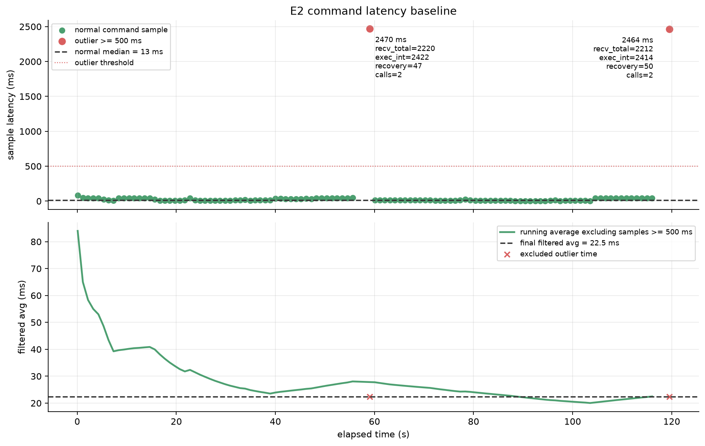

Additional diagnostic runs investigated periodic command-latency spikes observed during repeated `battery?` queries. The internal timing metrics showed that the spikes were dominated by accumulated UDP receive wait time. In the final command-baseline run, the two long command samples had `command_executor_recv_wait_total_ms` around 2.2 seconds, `command_executor_calls` equal to two, and `command_recovery_count` equal to one, while the final high-level command result was still `OK`. The internal attempt log showed that each event contained three timed-out `battery?` attempts, one successful SDK recovery command, and then a successful `battery?` retry. This indicates that the client sent a query, did not receive a response before the SDK timeout, performed retry/recovery, and then received a valid response.

To verify whether this was caused by the API or by the network path, the command baseline was repeated while capturing UDP traffic with `tcpdump`. The packet capture showed the same behavior externally. Around one transient event, `battery?` packets were sent repeatedly without a timely response; recovery then sent `command`, the drone replied `ok`, and the next `battery?` returned normally. Around another event, a `battery?` response arrived after the SDK timeout window, which explains why the API had already treated the attempt as failed. Therefore, the evidence indicates a real transient UDP transport outage or delayed drone response, not local CPU load, GUI rendering, parsing overhead, mutex blocking, or the API failing to read a response that had arrived on time.

This result motivated the `TRANSIENT_LOSS_RECOVERED` event classification. A recovered transient outage is different from a persistent connection loss: it is important for diagnostics and future control design, but it should not be logged as if the command channel remained disconnected after the call.

### 7.2 Telemetry

Telemetry quality remained generally healthy across the core experiments. In this report, quality means transport freshness and continuity, not subjective signal quality. `OK` means the latest telemetry packet age is at most 200 ms and the packet interarrival time is at most 300 ms. `DEGRADED` means the latest packet age is at most 500 ms and interarrival is at most 500 ms. `STALE` means data is older than those limits, and `NO_DATA` means no packet was received.

Telemetry age is important because stale telemetry would be unsafe for future feedback control. Packet age is the age of the latest known telemetry sample at the time of measurement. Packet interarrival is the spacing between consecutive telemetry packets. The analysis therefore plots packet age directly, and the timeline view shows how packet age and packet interarrival evolve during each run relative to the `OK`, `DEGRADED`, and `STALE` thresholds. The power-cycle run is shown separately in the timeline because intentionally powering off the drone creates a large age spike that would otherwise compress the other traces.

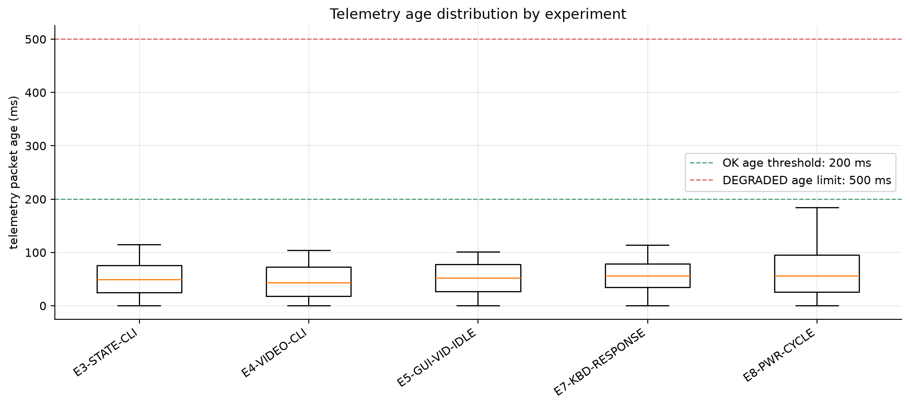

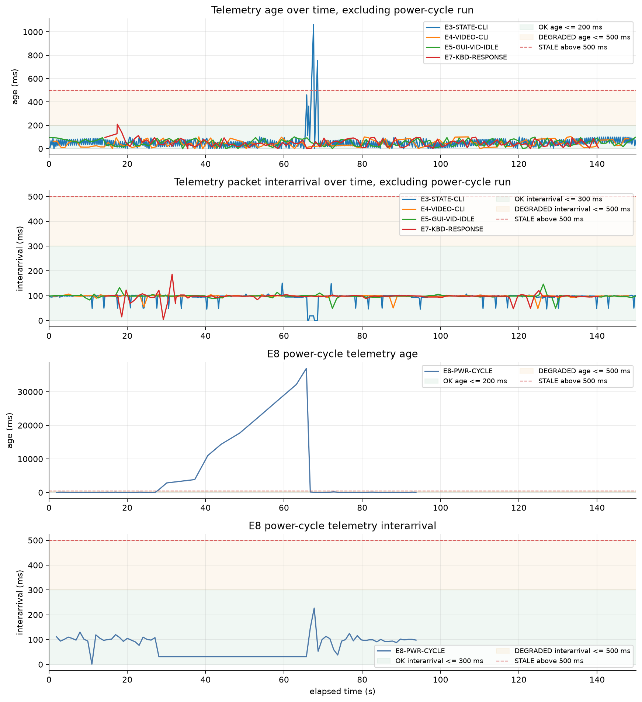

### 7.3 Video Performance

The FFmpeg Stream path achieved usable real-time video performance. The CLI video baseline ended with video quality `OK` and decoder FPS around 31.3. The GUI and keyboard-flight runs also maintained video quality `OK` with decoder FPS around 31-32. As with telemetry, video quality here means stream freshness and continuity: recent decoded frames with acceptable interarrival are `OK`; delayed frames are `DEGRADED`; stale or missing frames are represented as `STALE` or `NO_DATA`.

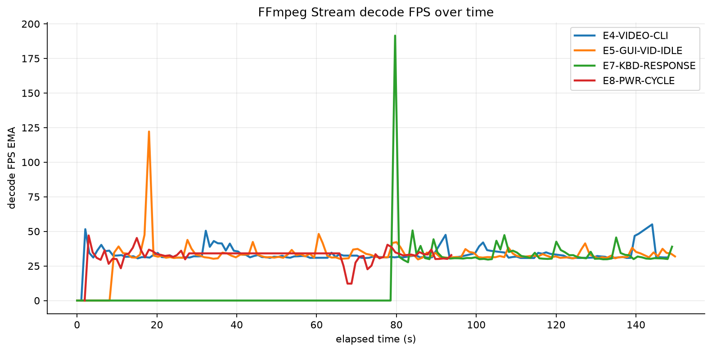

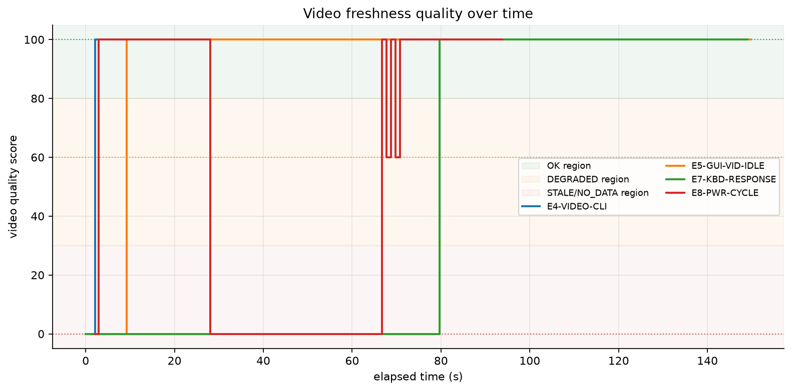

These results support the decision to use FFmpeg Stream as the project's only video runtime path.

### 7.4 GUI Responsiveness

The Control Panel was tested in idle video operation and during keyboard flight. GUI timing metrics distinguish event-loop scheduling delay from the actual cost of refreshing video and drawing plots. The reference periods are approximately 120 ms for the vision refresh timer and 250 ms for the state/plot refresh timer.

The repeated keyboard-flight run was used to check whether moving critical commands into a background command worker removed the GUI stalls observed earlier. The result was positive: the vision timer stayed near its expected period with median 125 ms, p95 125 ms, and maximum 148 ms. The state/plot timer stayed near its expected period with median 249 ms, p95 250 ms, and maximum 253 ms. `command_mutex_wait_ms` remained 0 ms, which indicates that GUI refresh paths were not waiting on the command mutex.

The SDK response behavior was still imperfect. In the repeated run, `takeoff` was logged as `TIMEOUT`, while `land` returned `OK`. However, this timeout no longer froze the Control Panel. This distinction is important: the background worker does not make the drone SDK response model more reliable, but it prevents SDK timeout behavior from blocking the Qt event loop.

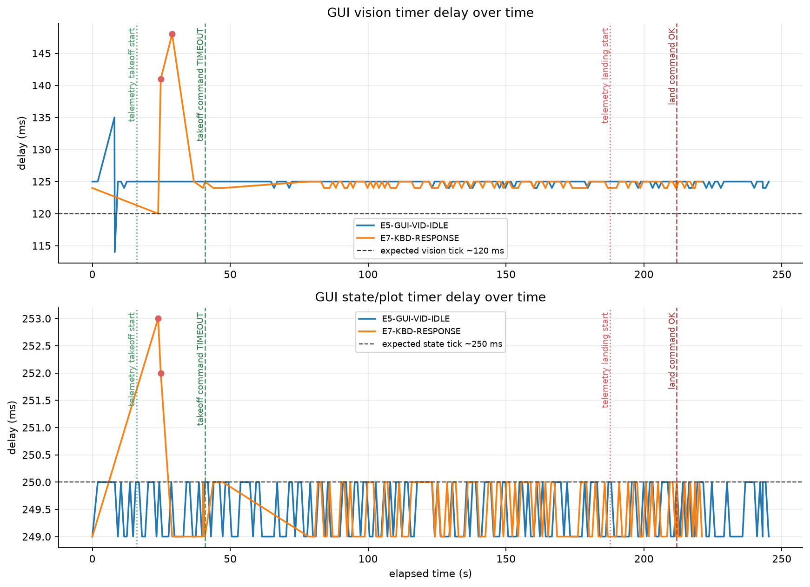

The idle GUI run maintained video and telemetry freshness, but timing metrics remain important because manual control safety depends on avoiding long UI stalls.

### 7.5 Keyboard RC Flight

The keyboard flight experiment is the main real-operation test. During this run, the drone was airborne, video was active, telemetry was logged, and keyboard-generated RC commands were sent by the dedicated RC worker.

The height and vertical RC plot separates the physical height readings from the operator's vertical RC command. The takeoff and landing markers are estimated from telemetry rather than from delayed command log rows. The physical takeoff marker is the first sustained increase in SDK height or time-of-flight distance, and the landing marker is the beginning of the final sustained descent toward the ground. In the repeated E7 run, telemetry indicates a physical takeoff marker around 16.0 s and a landing-start marker around 187.7 s. The logged `takeoff` command row appears later than the physical takeoff marker, so this run is useful for GUI and RC behavior, but not for attributing physical takeoff timing directly to the logged `takeoff` command row.

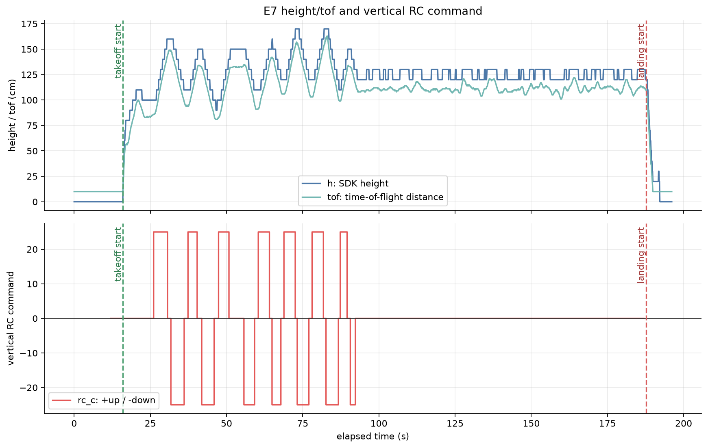

The state log confirms a real flight and shows the evolution of attitude, velocity, height, barometer, acceleration, battery, and temperature. The subplot matrix focuses on the flight window, from approximately 7 seconds before the telemetry-estimated takeoff start to approximately 7 seconds after the telemetry-estimated landing start. Acceleration fields are reported in thousandths of gravity (`0.001g`), as exposed by the Tello SDK.

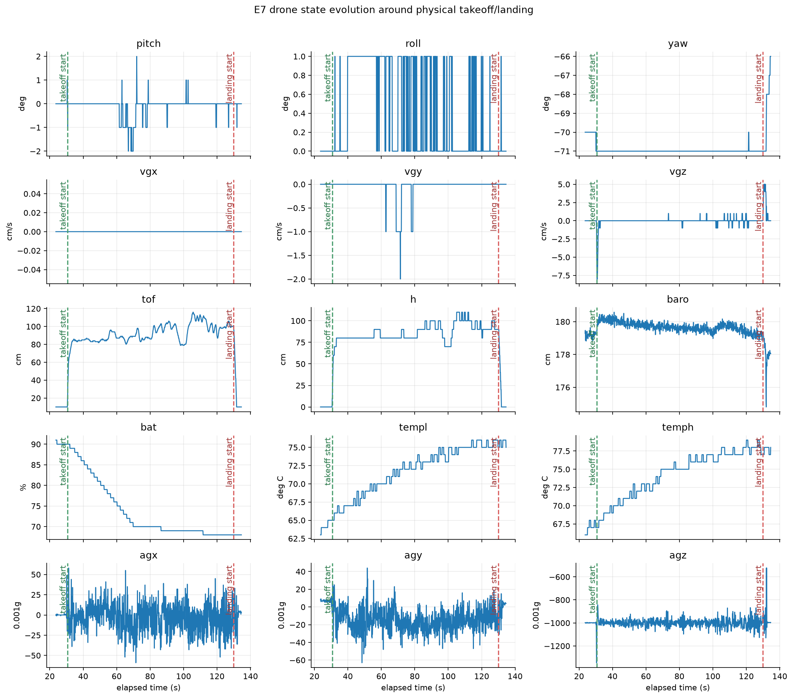

The RC channel plot shows the keyboard-generated control commands over time.

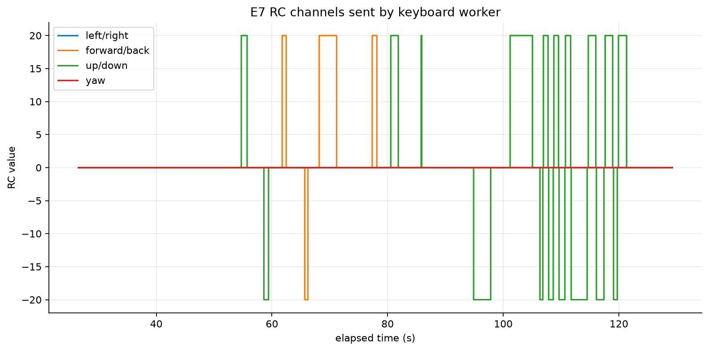

During the same flight, telemetry and video freshness stayed `OK`, and decode FPS remained around 33.7 FPS by the end of the run. This indicates that the system could maintain video, telemetry, and RC operation simultaneously in this test.

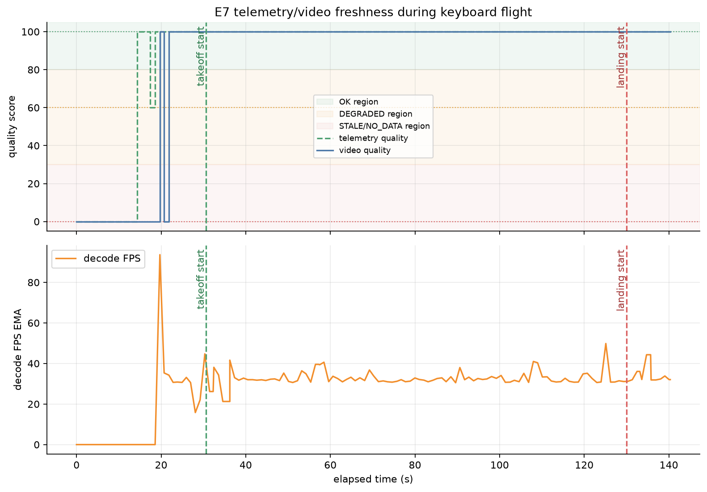

The RC response-latency estimate was computed from the keyboard-flight state data. Consecutive non-zero RC samples were grouped into command pulses. For each pulse, the command timestamp was taken from the monotonic RC command timestamp, and the response timestamp was the first later telemetry sample that crossed a channel-specific threshold.

The most direct estimates are vertical and yaw. For vertical pulses (`rc_c != 0`), response was detected when `h` or `tof` changed by at least 5 cm in the expected direction. For yaw pulses (`rc_d != 0`), response was detected when yaw changed by at least 3 degrees in the expected direction. Lateral and forward/backward translation could not be measured directly from `vgx` and `vgy` in this run because those SDK velocity fields stayed close to zero. Instead, left/right (`rc_a`) was estimated from roll response, and forward/back (`rc_b`) was estimated from pitch response, using a 2-degree attitude threshold. These are therefore attitude-response estimates, not direct displacement measurements.

The repeated E7 run produced the following estimated response latencies:

| RC channel | Motion | Telemetry proxy | Valid pulses | Median | Mean | Range |
|---|---|---|---:|---:|---:|---:|
| `rc_a` | left/right | roll attitude | 4/7 | 358 ms | 356 ms | 293-413 ms |
| `rc_b` | forward/back | pitch attitude | 5/12 | 361 ms | 378 ms | 305-514 ms |
| `rc_c` | up/down | height/time-of-flight | 14/14 | 638 ms | 619 ms | 399-820 ms |
| `rc_d` | yaw | yaw attitude | 9/9 | 411 ms | 488 ms | 303-923 ms |

Each point in the reaction plot represents one detected RC pulse. Blue points indicate positive RC commands and orange points indicate negative RC commands. The horizontal marker shows the median for each channel.

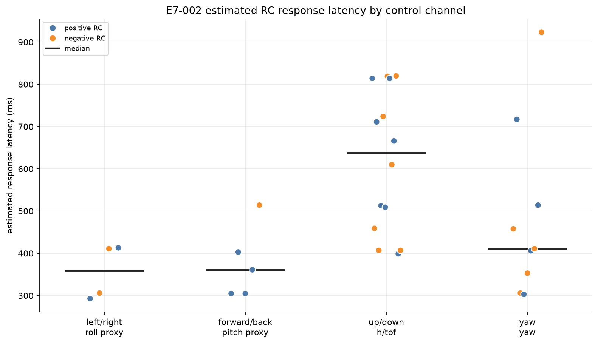

### 7.6 Recovery

The power-cycle experiment validated recovery after the drone restarted while the process remained running. The run captured recovery rows including a successful `power_streamon` stage.

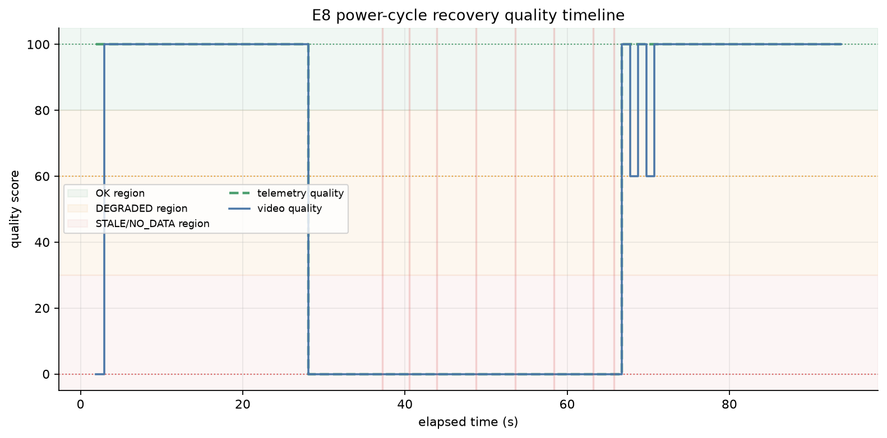

The data-age plot shows how video and telemetry became stale during the outage and then returned to healthy values after recovery.

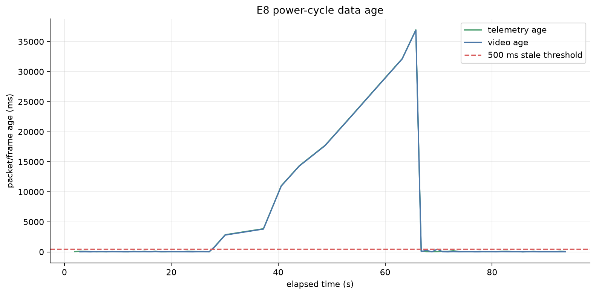

The Wi-Fi loss experiment validated command-channel reconnect behavior. The run produced command failures during the outage but ended with command result `OK`, indicating that reconnect behavior restored the SDK command path.

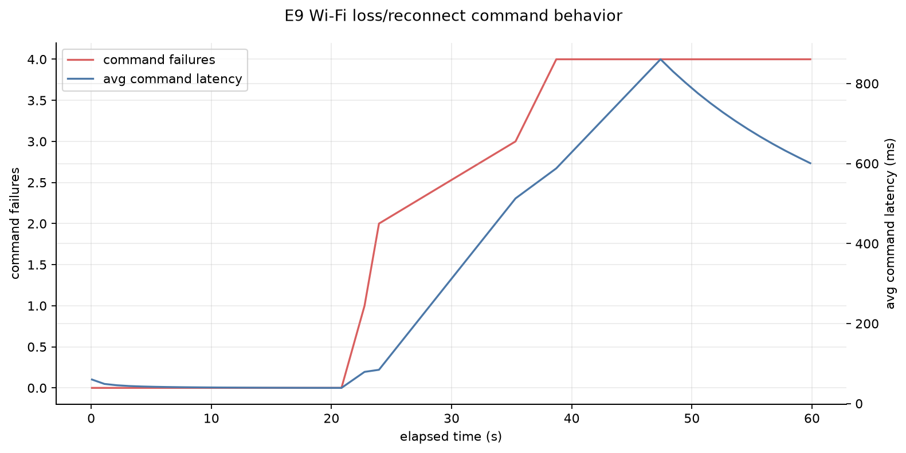

## 8. Discussion

The results show that the core command, telemetry, video, and GUI components are functional under real-drone conditions. The baseline command experiment suggests that normal SDK queries are reliable under stable Wi-Fi. Telemetry remains fresh enough for monitoring, and the FFmpeg Stream backend provides usable video performance for live operation.

The most important implementation decision in the video subsystem was standardizing on FFmpeg Stream. By allowing FFmpeg to own UDP stream reading, H264 parsing, decoding, and frame timing, the application avoids maintaining a fragile custom video parser and obtains smoother live video during flight.

Keyboard RC control required special attention because control commands can be safety-critical. The dedicated RC worker reduces the risk that GUI event-loop stalls keep a movement command active longer than intended. The repeated flight experiment showed that RC commands were recorded, non-zero commands were sent, the drone responded physically, and telemetry/video remained `OK`. The strongest physical response evidence came from vertical height/time-of-flight changes and yaw changes; lateral and forward/backward response was visible through attitude proxies.

The command-channel packet-capture diagnosis also has implications for RC control. Query commands such as `battery?` wait for a response, so a delayed or missing UDP response appears as a timeout, retry, or recovered transient outage. RC commands are different: they are sent continuously through a no-wait path. A single lost RC packet is usually harmless because the dedicated worker sends another RC command shortly afterward. A longer UDP outage is more important. If the last RC command received by the drone was nonzero and neutral `rc 0 0 0 0` packets are delayed or lost, the drone may continue the previous motion until it receives a newer RC command. This is why the implementation emphasizes an independent RC worker, repeated neutral output when no input is active, stale-input detection, and high-priority neutral RC before critical commands. Future closed-loop control should treat command-channel freshness as a safety signal, not only as a logging metric.

To support this, the core metrics layer now exposes an aggregate link-quality state. This state combines telemetry freshness, video freshness when video is active, command/keepalive health, and RC packet cadence while RC control is active. It reports `OK`, `DEGRADED`, `STALE`, `BLACKOUT`, or `NO_DATA`, together with a numeric score and a conservative `safe_for_nonzero_rc` flag. The Qt Control Panel displays this quality at the top of the application, and the ROS driver publishes the same signal as `/tello/link_quality`.

For closed-loop control, this link-quality signal should be treated as a gating input. When quality is `OK`, normal command output can proceed. When quality is `DEGRADED`, a controller should consider reducing command magnitude, increasing neutral-command repetition, or holding the previous safe setpoint only briefly. When quality becomes `STALE` or `BLACKOUT`, the controller should avoid sustained nonzero RC and should prefer neutral RC, hover, landing, or emergency behavior depending on the flight context. The important point is that communication health becomes part of the control decision rather than only a post-run diagnostic.

The GUI timing analysis initially showed that blocking critical command calls could affect responsiveness when their timeout result was logged. To address this, the Control Panel was updated so critical commands and stream/recovery commands run in a background command worker and report results back to the GUI through queued callbacks. The repeated E7 run showed that GUI timer delays remained close to their expected periods even though the `takeoff` command still timed out at the SDK response layer. This confirms the intended separation between command waiting and GUI responsiveness.

Recovery behavior is also important because real Wi-Fi and drone power states are not perfectly stable. The power-cycle experiment showed that the system can detect a stalled video/session state and recover after SDK re-entry and stream restart.

## 9. Limitations

The project has several limitations:

1. Experiments were performed with a single DJI Tello drone and one test environment.
2. Wi-Fi conditions are environment-dependent and may vary across rooms, laptops, and drivers.
3. The RC reaction latency estimate is based on onboard telemetry, not external motion capture. Lateral and forward/backward response estimates use attitude proxies because direct SDK translational velocity fields did not provide reliable movement evidence in the repeated keyboard-flight run.
4. The current system does not implement a closed-loop controller.
5. The ROS2 bridge has been implemented, built, and validated in basic real-drone operation, but external autonomy nodes and longer stress runs remain future work.
6. Some command responses, especially around `takeoff` and `land`, can be delayed or time out even when the drone physically executes the action. The GUI no longer waits for these responses on the main event loop, but the underlying SDK ambiguity remains.
7. Thermal behavior can affect long back-to-back experiments.

## 10. Future Work: ROS2 Validation and Closed-Loop Control

The ROS2 integration is now implemented as a thin bridge that reuses the core C++ library rather than duplicating command, telemetry, video, or recovery logic. Basic real-drone operation has been validated through the launch path, ROS-mode GUI connection, telemetry, and video. The next stage is to use the bridge as the interface for future robotics experiments and external autonomy nodes.

Future ROS2 work should:

1. run longer end-to-end drone tests using `ros2 launch tello_bringup control_panel.launch.py`;
2. validate `/tello/cmd_vel` RC mapping against observed drone behavior;
3. confirm that GUI manual override blocks autonomous `/cmd_vel` until autonomy is explicitly re-enabled;
4. validate `/tello/link_quality` during telemetry gaps, command timeouts, and RC operation;
5. test video publication through `/tello/video/image_raw` with ROS visualization or recording tools;
6. integrate a small external autonomy node that publishes normalized `/tello/cmd_vel`;
7. use `safe_for_nonzero_rc` as a gating input for any future closed-loop controller.

This future work will move the system from an implemented ROS driver toward a tested robotics platform suitable for future closed-loop control experiments.

## 11. Conclusion

This project produced a modular C++ communication, telemetry, video, metrics, control, and ROS integration system for the DJI Tello drone. The system includes a reusable core library, command-line tools, a Qt Control Panel, FFmpeg-based video display, CSV experiment logging, configurable keyboard RC control, and a ROS2 bridge.

Real-drone experiments validated the main engineering claims. The command channel was reliable in the baseline run, telemetry and video freshness remained healthy in core scenarios, FFmpeg Stream provided practical live video performance, keyboard RC control worked during flight, and recovery was demonstrated after a drone power-cycle. The project is now ready for final report refinement and deeper ROS2 validation with external autonomy nodes.

## Appendix A: DJI Tello SDK Command Summary

| Command | Type | Purpose |
|---|---|---|
| `command` | setup | enters SDK mode |
| `battery?` | query | returns battery percentage |
| `wifi?` | query | returns Wi-Fi signal information |
| `speed?` | query | returns the current speed setting |
| `time?` | query | returns motor time |
| `sdk?` | query | returns SDK version |
| `sn?` | query | returns serial number |
| `streamon` | video | enables H264 video streaming on UDP port `11111` |
| `streamoff` | video | disables video streaming |
| `takeoff` | flight | starts takeoff |
| `land` | flight | starts landing |
| `emergency` | safety | immediately stops motors |
| `speed x` | configuration | sets movement speed, where `x` is usually `10` to `100` |
| `rc a b c d` | flight control | sends continuous motion commands for left/right, forward/back, up/down, and yaw |
| `rc 0 0 0 0` | flight control | neutral RC command used to stop commanded motion |

## Appendix B: Experiment Summary

| ID | Primary Evidence |
|---|---|
| `E1-SMOKE-CMD` | SDK entry works before the full experiment sequence |
| `E2-CMD-BASE` | command latency and failure rate under stable conditions |
| `E3-STATE-CLI` | telemetry freshness without GUI/video load |
| `E4-VIDEO-CLI` | FFmpeg Stream decode behavior without Qt rendering |
| `E5-GUI-VID-IDLE` | Control Panel telemetry/video behavior while stationary |
| `E6-KBD-PROFILE` | keyboard profile persistence and mapping correctness |
| `E7-KBD-RESPONSE` | airborne keyboard RC response, video, and telemetry behavior |
| `E8-PWR-CYCLE` | recovery after drone restart |
| `E9-WIFI-LOSS` | command-channel recovery after Wi-Fi loss |

## Appendix C: Build Environment Notes

The project uses CMake and C++17. Video support requires FFmpeg development packages for `libavformat`, `libavcodec`, `libavutil`, and `libswscale`. FFmpeg is a required dependency for the video-enabled build because the project supports only the FFmpeg Stream video path.

## Appendix D: Offline Tests

The current offline test suite can be executed without a connected drone:

```bash
ctest --test-dir build/tello_core_standalone \
  -L offline \
  --output-on-failure
```

The existing offline tests are:

| Test | Purpose |
|---|---|
| `unit_state_parser` | validates parsing of Tello SDK telemetry state packets into structured state fields |
| `unit_metrics_collector` | validates central metrics aggregation, CSV output behavior, and quality-related metrics used by the experiment logs |

These tests cover the telemetry parser promised in the milestone plan and part of the metrics infrastructure used for evaluation. Additional offline tests for command retry behavior, UDP loopback behavior, `StateReceiver` runtime behavior, link-quality classification, and CSV schema stability would further harden the system, but those were not explicitly required as automated tests in the original milestone plan.
