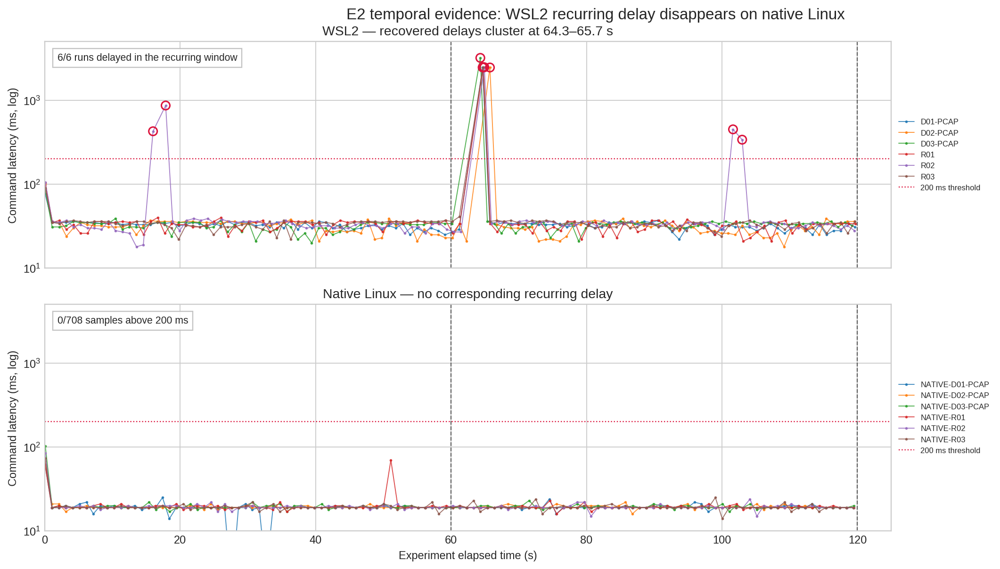
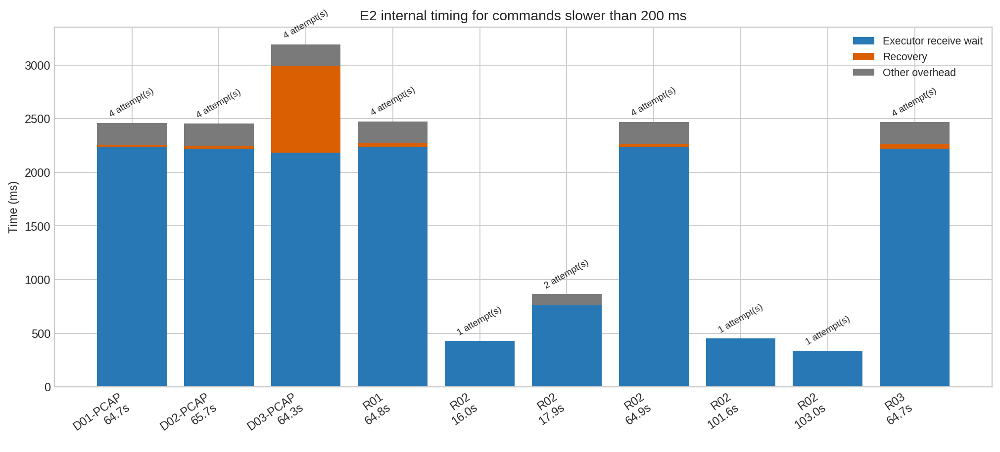
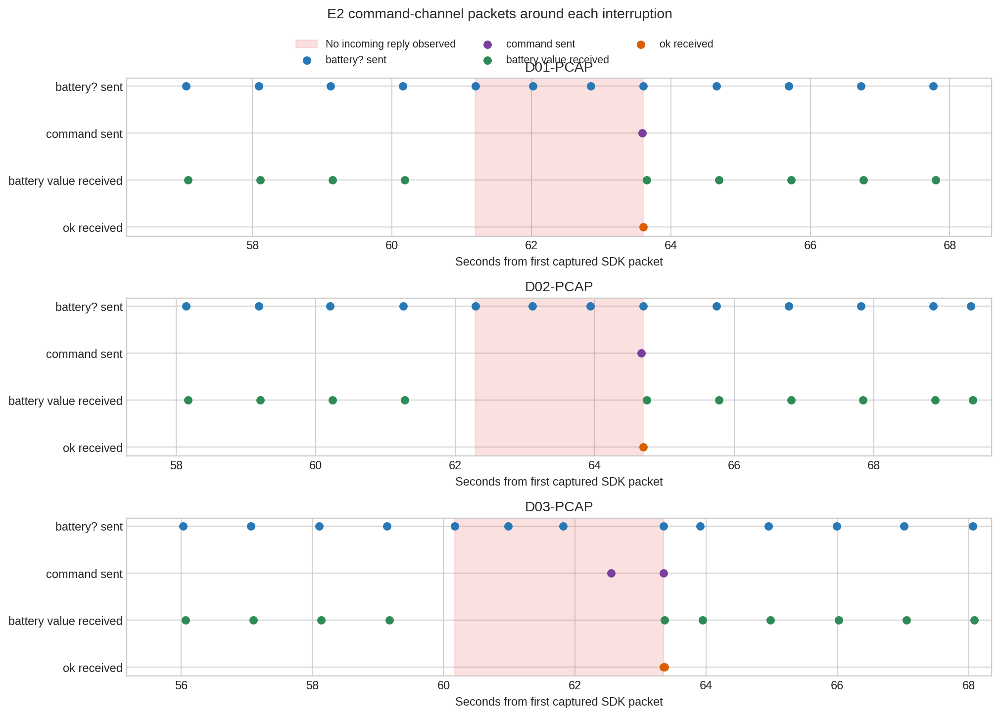

# Development and Evaluation of a Modular C++ Communication, Control, Visualization, and ROS Integration System for the DJI Tello Drone

**Course:** CS 500 Project  
**Student:** Gabriel Fernandes  
**Supervisor:** Prof. Stefan Bruda  
**Program Context:** Course-based M.Sc. project  
**Status:** Final report

## Abstract

This project developed and evaluated a modular C++ software stack for communicating with, monitoring, and controlling a DJI Tello drone. A reusable core library owns UDP command execution, asynchronous telemetry, FFmpeg video decoding, runtime metrics, recovery, and safety-oriented RC control. Command-line tools and a Qt Control Panel reuse that core for diagnosis, live operation, visualization, CSV recording, and configurable keyboard flight. A ROS2 bridge was also implemented around the same core imported and built from source.

Evaluation used repeated real-drone experiments spanning command latency, telemetry continuity, video decoding, GUI scheduling, grounded RC safety, airborne response, drone power-cycle recovery, host Wi-Fi reconnection, and ROS2 integration. An initially recurring 2.4-3.2 s command blackout under WSL2 motivated a controlled native-Linux reproduction. Every WSL2 command run contained a recovered interruption, whereas 708 native command samples completed with zero retry, timeout, or recovery and physical-interface captures contained a response for every request. Native telemetry remained near 9.88 Hz without gaps of 300 ms or more; native 960×720 video remained near 30 fps; GUI and flight runs retained fresh telemetry/video; grounded RC returned to neutral without unsafe nonzero output; and all recorded power-cycle and Wi-Fi interruption trials recovered. Real-drone ROS2 acceptance exposed the expected graph and produced consecutive link-quality samples with score 100 and telemetry, video, and command classified as OK. The results support native Linux as the deployment environment and demonstrate a reusable experimental basis for future closed-loop work.

## 1. Introduction

Small aerial robots combine networking, asynchronous sensing, video, control, safety, and user interaction in a compact platform. The DJI Tello is attractive for applied robotics because its SDK is accessible over Wi-Fi, but its UDP transport also exposes realistic engineering problems: delayed or missing command responses, independently arriving telemetry, compressed video, shared-resource contention, and the safety consequences of stale motion commands.

The goal of this CS 500 project was therefore not to build a one-off flight script, but a reusable C++ communication and control stack shared by command-line tools, a desktop Control Panel, and a ROS2 integration layer. The main objectives were to:

1. implement a reliable and diagnosable SDK command channel;
2. parse and expose asynchronous drone telemetry;
3. receive, decode, and display H264 video through FFmpeg;
4. collect metrics detailed enough to distinguish application, GUI, and transport behavior;
5. provide a Qt Control Panel for operation and repeatable data collection;
6. implement configurable keyboard RC with independent cadence and neutral safety;
7. evaluate ordinary operation and recovery through repeated real-drone experiments;
8. expose the same runtime through ROS2 without duplicating drone ownership.

A major experimental issue shaped the final evaluation. Early repeated command tests under WSL2 showed an interruption at approximately 60-66 seconds in every run. Public API calls eventually returned successfully, but only after multiple UDP receive timeouts and SDK recovery, producing individual latencies around 2.45-3.19 seconds. Telemetry-only tests did not show corresponding continuity gaps. This raised a causal question that could not be answered from application logs alone: was the delay caused by the C++ executor, the drone, the radio, or the additional WSL2/Hyper-V/Windows networking path?

The investigation therefore became part of the project rather than an incidental debugging note. Command runs were repeated with matched packet captures, then reproduced on Ubuntu native Linux using the same C++ implementation and drone. Telemetry was also repeated across WSL2 and native Linux to determine whether the observed effect was command-specific or a broader stream-continuity problem. Once the native evidence removed the periodic blackout, later video, GUI, RC, flight, and recovery experiments were executed only on native Linux.

## 2. DJI Tello SDK Background


The DJI Tello SDK communicates over Wi-Fi using UDP. The host computer connects to the drone's Wi-Fi network and communicates with the drone at `192.168.10.1`. Three channels are central to this project:

| Channel | UDP Port | Direction | Purpose |
|---|---:|---|---|
| Command | `8889` | host to drone, drone to host | SDK commands and command responses |
| Telemetry | `8890` | drone to host | periodic state packets |
| Video | `11111` | drone to host | H264 video stream |

Before most SDK functionality is available, the host sends `command` to enter SDK mode. After that, command strings such as `battery?`, `takeoff`, `land`, `streamon`, and `streamoff` can be sent to the command port. Many SDK commands return a response such as `ok`, `error`, a numeric value, or no response before the client timeout expires. Because the protocol is UDP-based, software must be prepared for delayed, missing, or ambiguous responses.

The telemetry stream is different from the command channel. Once the drone is in SDK mode, it periodically sends state packets to the host. These packets include fields such as attitude, velocity, height, time-of-flight distance, battery, barometer, and temperature. Telemetry is not requested one packet at a time; it is received asynchronously by a background receiver.

The main telemetry fields used by this project are:

| Field | Meaning | Unit |
|---|---|---|
| `pitch` | pitch attitude | degrees |
| `roll` | roll attitude | degrees |
| `yaw` | yaw attitude | degrees |
| `vgx` | velocity along the SDK x-axis | cm/s |
| `vgy` | velocity along the SDK y-axis | cm/s |
| `vgz` | velocity along the SDK z-axis | cm/s |
| `templ` | lowest measured temperature | degrees Celsius |
| `temph` | highest measured temperature | degrees Celsius |
| `tof` | downward time-of-flight distance | cm |
| `h` | SDK-reported height | cm |
| `bat` | battery percentage | percent |
| `baro` | barometer-derived altitude measurement | cm |
| `time` | motor running time | seconds |
| `agx` | acceleration along the SDK x-axis | `0.001g` |
| `agy` | acceleration along the SDK y-axis | `0.001g` |
| `agz` | acceleration along the SDK z-axis | `0.001g` |

Three altitude-related fields are especially relevant for the flight analysis. `tof` is the time-of-flight distance in centimeters, measured by a downward distance sensor that estimates range from the time required for an emitted signal to reflect back to the drone. `h` is the SDK-reported height in centimeters. `baro` is a barometer-derived altitude measurement in centimeters, based on air pressure. In this project, `h` and `tof` are used to detect short vertical RC responses because they are easier to interpret over low-altitude indoor motion. `baro` is useful as a complementary trend signal but is not used alone for fine reaction-time estimates.

The video stream is enabled with `streamon` and disabled with `streamoff`. The drone sends H264 video over UDP port `11111`. In this project, FFmpeg opens the UDP stream directly, handles H264 parsing and decoding, and returns decoded RGB frames to the application.

The `rc a b c d` command is the SDK's continuous motion command. The four values represent:

1. `a`: left/right velocity command;
2. `b`: forward/back velocity command;
3. `c`: up/down velocity command;
4. `d`: yaw command.

Each value is typically in the range `-100` to `100`. A neutral command, `rc 0 0 0 0`, means no commanded motion. For safe manual control, software must return to neutral when no key or joystick input is active.

## 3. System Architecture

The project is centered on a reusable C++ core library that contains the drone-specific communication and processing logic. The Qt interface is a separate reusable UI library whose behavior is expressed through a ROS-neutral `ControlBackend` contract. This allows the standalone and ROS executables to present the same widgets, plots, profiles, history, and CSV workflow while using different runtime owners.


The diagram separates shared source components from runtime ownership. In standalone mode, `tello_control_panel` combines the common UI with `StandaloneBackend`, while the CLI tools consume `tello_core` directly; whichever standalone process is active owns its drone UDP channels. In ROS mode, `tello_control_panel_ros` combines the same UI with `RosBackend` and communicates only through ROS topics and services; `tello_driver_node` is the sole ROS process that owns the core runtime and drone UDP channels.

The main components are:

- `UdpSocket`: low-level UDP send/receive abstraction.
- `CommandExecutor`: command send/receive policy with timeout and retry behavior.
- `TelloClient`: high-level drone API, SDK session state, keepalive, and recovery behavior.
- `StateParser`: parser for raw Tello state strings.
- `StateReceiver`: background telemetry receiver and thread-safe latest-state cache.
- `VideoStreamReaderFfmpeg`: FFmpeg Stream reader for H264 video over UDP.
- `MetricsCollector`: central runtime metrics aggregator and CSV export schema.
- CLI applications: smoke commands, command watch, state watch, and video watch.
- `tello_control_panel_ui`: reusable Qt widgets, plots, profiles, history, CSV, and common interaction logic.
- `ControlBackend`: ROS-neutral DTO and capability contract between the common UI and a runtime backend.
- `StandaloneBackend`: direct owner of the core client, telemetry, FFmpeg, keepalive, recovery, and workers used by `tello_control_panel`.
- `RosBackend`: topic/service adapter used by `tello_control_panel_ros`; it does not open Tello UDP sockets.
- `tello_driver_node`: ROS command broker and exclusive ROS-mode owner of `TelloClient`, `StateReceiver`, FFmpeg, and the drone UDP channels.

The architecture separates transport, parsing, client state, metrics, and user interface. This also supports ROS2 integration, where the ROS layer wraps the core library instead of reimplementing the command, telemetry, video, and safety logic.

## 4. Implementation

### 4.1 Command Channel

The command channel uses UDP to send SDK commands to the drone and wait for responses for synchronous SDK operations. Reliability is handled in layers. `UdpSocket` provides transport operations and timeout handling. `CommandExecutor` handles command execution policy, including retry and timeout behavior. `TelloClient` owns higher-level SDK state and exposes methods such as SDK entry, takeoff, land, stream control, keepalive, and recovery. 

The client tracks connection state through connected, recovering, and disconnected states. It also exposes connection events such as lost, restored, and transient loss recovered, which are useful for experiments and logging. A keepalive loop can periodically send `battery?` queries to keep the SDK session active when no RC stream is running. This is necessary because the Tello SDK states that if the drone receives no command for 15 seconds, it automatically lands. During idle experiments, periodic lightweight commands prevent the drone from treating the session as inactive while avoiding unnecessary motion commands.

Several command-channel details were refined during real-drone testing. Critical commands such as `takeoff` and `land` are protected by preflight neutral RC behavior. RC commands use a no-wait path so continuous control does not wait behind slow query commands. In the Qt Control Panel, blocking critical commands and stream-control commands are dispatched through a background command worker; the GUI receives the final result through a queued callback and remains responsive while the command is waiting for an SDK response or timeout. Metrics include command latency, failures, command mutex wait time, command source, raw attempt logs, internal attempt logs, recovery timing, and connection state.

An important refinement was the distinction between a real connection loss and a transient command outage that recovers inside the same high-level API call. Earlier logs could report `LOST` as soon as one internal SDK command attempt timed out, even if retry or recovery succeeded and the public API call returned `OK`. The client now records the full `command_internal_attempt_log`, including all executor calls and recovery calls made inside one high-level command. If at least one internal attempt failed but the final command result is `OK`, the event is classified as `TRANSIENT_LOSS_RECOVERED` instead of a persistent loss. This produces a more accurate operator and experiment log.

### 4.2 Telemetry

Telemetry is received from the Tello state channel on UDP port `8890`. `StateReceiver` runs a background receive loop, parses each packet with `StateParser`, and stores the latest valid state. Consumers access telemetry through a thread-safe latest-state cache.

The project records wall-clock timestamps for correlation with external logs and packet captures, and monotonic elapsed timestamps for duration and ordering within a run. Telemetry age, receive rate, and packet-interarrival metrics are computed with a monotonic clock, preventing system-clock adjustments from creating artificial gaps.

### 4.3 Video Pipeline

The video pipeline uses FFmpeg Stream as the only supported runtime path. The drone sends H264 video over UDP after `streamon`. `VideoStreamReaderFfmpeg` opens:

```text
udp://@0.0.0.0:11111?overrun_nonfatal=1&fifo_size=5000000
```

FFmpeg handles UDP stream reading, H264 parsing, decoding, and frame timing internally. The application receives decoded RGB frames and displays them in the Qt Control Panel. This design was selected because it produced smoother live video during real flight operation and avoids maintaining a second custom H264 packet assembly path.

The video metrics include packets read, bytes read, latest frame age, decoded frames, decode FPS, decode errors, frame size, keyframes, and UI frame conversion/display counters. The same video path is used by both the CLI video experiment and the Control Panel.

### 4.4 Metrics and Experiment Logging

`MetricsCollector` centralizes runtime metrics across command, telemetry, video, GUI, recovery, and control behavior. CSV rows include experiment metadata followed by metrics groups for:

1. command latency and failures;
2. telemetry counters and freshness;
3. video packet/decode behavior;
4. frame size and decoder FPS;
5. recovery status;
6. GUI timing;
7. RC stream state and values;
8. keepalive state;
9. event/log messages.

The word "quality" in the experiment results means transport freshness and continuity. It does not mean subjective image sharpness, scene visibility, or flight-control accuracy. The labels are computed from packet age and interarrival timing:

| Label | Meaning |
|---|---|
| `NO_DATA` | no packet has been received |
| `OK` | latest packet age is at most 200 ms and interarrival is at most 300 ms |
| `DEGRADED` | latest packet age is at most 500 ms and interarrival is at most 500 ms |
| `STALE` | data is too old for safe control assumptions |

These labels are intended to support future closed-loop control decisions. `OK` means the stream is fresh enough for normal monitoring. `DEGRADED` suggests caution. `STALE` and `NO_DATA` should be treated as unsafe for feedback control.

Packet age and packet interarrival measure different aspects of the stream. Packet age is how old the most recent packet is at the moment a metrics row is written. If no new packet arrives, age increases. Packet interarrival is the elapsed time between two consecutive received packets. A stream can have regular interarrival while packets are flowing, but high age after packets stop arriving.

### 4.5 Qt Control Panel

The Qt Control Panel is the main human-facing application. It has a global control area above the tabs, followed by Config and Operation tabs. The annotated screenshots below show the corresponding interface areas; the numbered descriptions are intended to match those figures.

#### Global Controls Above The Tabs


1. **Top Status Row:** summarizes connection state, SDK readiness, RC stream state, keyboard-control state, speed setpoint, aggregate link quality, Wi-Fi status, battery, temperature, and state-recording status.
2. **Connection Controls:** provide `Connect + SDK` and `Disconnect` actions. `Connect + SDK` initializes the command channel, enters SDK mode, starts telemetry reception, and starts SDK keepalive when appropriate.
3. **Basic Flight Controls:** expose high-priority commands such as `takeoff`, `land`, `emergency`, `streamon`, `streamoff`, and hover/stop. `takeoff` requires confirmation, `emergency` is visually emphasized, and blocking critical commands are executed by a background command worker so the GUI event loop does not wait for SDK timeouts.
4. **Log Panel:** records user-visible events, command responses, recovery events, and state transitions. The same log messages can also be stored in the GUI metrics CSV for experiment correlation.

#### Config Tab Features


1. **Logging Export Configuration:** selects GUI metrics and state CSV paths, starts/stops recording, clears buffered recordings, and exports both CSV files.
2. **Control Profiles:** creates, edits, saves, and deletes keyboard control profiles while preserving at least one default profile.
3. **RC Aggression:** defines the absolute RC magnitude used by mapped keyboard movements.
4. **Input Mapping:** maps keys to left, right, forward, back, up, down, yaw left, and yaw right actions.
5. **SDK Read Commands:** provides quick buttons for query commands such as `battery?`, `speed?`, `time?`, `wifi?`, `sdk?`, and `sn?`.
6. **Set Speed:** sends `speed x`, with the default setpoint initialized to `100`.
7. **Movement, Rotation, and Flip Commands:** exposes parameterized commands such as `up x`, `down x`, `left x`, `right x`, `forward x`, `back x`, `cw x`, `ccw x`, and `flip x`.
8. **Raw Command:** allows manually sending an SDK command string for testing or diagnostics.

#### Operation Tab Features


1. **Keyboard Control:** enables/disables keyboard RC control and shows the active profile and current RC vector.
2. **Dedicated RC Worker:** sends the desired RC command independently from the GUI event loop and falls back to neutral if input becomes stale.
3. **Manual RC Operation:** provides sliders for left/right, forward/back, up/down, and yaw, plus one-shot RC, zero-and-send, and continuous RC stream controls.
4. **State History:** displays telemetry history, selected state plots, buffer size, recording status, and a red/green REC indicator.
5. **Vision:** starts/stops FFmpeg Stream viewing, pauses live display, captures snapshots, and toggles the overlay.

The Control Panel also records user-visible logs into the metrics CSV, allowing post-run analysis to correlate GUI events with telemetry, video, and command behavior. On application close or Ctrl+C, the panel sends `emergency` if the drone is connected.

### 4.6 Keyboard RC Control

Keyboard RC control was implemented using configurable control profiles. A profile maps keyboard inputs to RC axes and defines a single aggression value used for all mapped movement commands. Profiles are stored persistently and can be edited in the Control Panel.

The initial concern during flight testing was that GUI stalls could cause a movement command to remain active after the user released the key. To mitigate this, RC sending was moved into a dedicated worker. The GUI updates a desired RC state, while the worker sends RC commands at a fixed cadence. If input becomes stale, the worker sends neutral RC. This design reduces coupling between GUI event-loop responsiveness and drone motion safety.

### 4.7 Validated Environment And Dependencies

The standalone and ROS2 deployments are built from the same `tello_core` source and therefore share the same native toolchain and multimedia/UI dependencies. The complete implementation and repeated real-drone campaign were validated on Ubuntu 20.04.6 LTS (Focal Fossa), x86_64, using Linux kernel 5.15, GCC 9.4.0, CMake 3.16.3, FFmpeg 4.2.7 development packages, and Qt 5.12.8. The project requires C++17 and CMake 3.16 or newer. ROS operation was additionally validated with ROS2 Foxy, the ROS distribution paired with Ubuntu 20.04 in this project.

| Component | Validated version or package | Used by |
|---|---|---|
| Operating system | Ubuntu 20.04.6 LTS, x86_64 | standalone and ROS2 |
| Linux kernel | 5.15 | standalone and ROS2 hardware tests |
| C++ compiler | GCC/G++ 9.4.0 with C++17 | standalone and ROS2 |
| Build system | CMake 3.16.3 or newer | standalone and source-built core under `colcon` |
| FFmpeg | 4.2.7: `libavformat`, `libavcodec`, `libavutil`, `libswscale` | command-line video, both Control Panels, and ROS driver |
| Qt | Qt5 Widgets 5.12.8 (`qtbase5-dev`) | standalone and ROS2 Control Panels |
| Package discovery | `pkg-config` | FFmpeg discovery in both builds |
| ROS middleware | ROS2 Foxy | ROS2 deployment only |
| ROS workspace tools | `vcstool`, `rosdep`, and `colcon` | ROS2 deployment only |

The common native dependencies are installed once before either build path:

```bash
sudo apt update
sudo apt install -y \
  build-essential \
  cmake \
  pkg-config \
  libavformat-dev \
  libavcodec-dev \
  libavutil-dev \
  libswscale-dev \
  qtbase5-dev
```

FFmpeg is required because it is the supported video-decoding path. Qt5 Widgets is required for the shared Control Panel UI. OpenCV is optional and enables the fallback viewer where available; it is not used by the primary FFmpeg/Qt runtime:

```bash
sudo apt install -y libopencv-dev
```

The ROS2 path additionally requires an existing ROS2 Foxy installation and the workspace import/dependency tools:

```bash
sudo apt install -y \
  python3-vcstool \
  python3-rosdep \
  python3-colcon-common-extensions
```

If `rosdep` has not previously been initialized, `sudo rosdep init` and `rosdep update` must be run once. Building from source on the target machine keeps FFmpeg, Qt5, glibc, compiler-runtime, and ROS ABI compatibility local to that Ubuntu installation; no precompiled `tello_core` release is required.

### 4.8 Standalone Build And Operation

In standalone mode, the CLI and Qt Control Panel link directly against `tello_core` and communicate with the drone through the SDK UDP channels. This is the mode used for E1-E9; E10 separately validates the ROS runtime with the real drone.

Clone the `dev` branch for development, auditing, project evaluation, or rebuilding on another machine:

```bash
git clone --branch dev https://github.com/Gfernandes10/CS-500.git
cd CS-500
```

Configure and build the core, CLI, shared Qt UI, and standalone Control Panel:

```bash
cmake -S tello_core -B build/tello_core_standalone
cmake --build build/tello_core_standalone
```

The offline tests do not require a drone:

```bash
cmake -E chdir build/tello_core_standalone \
  ctest -L offline --output-on-failure
```

For a basic hardware check, power on the Tello, connect the computer to the Tello Wi-Fi network, wait about 10-15 seconds after power-on, and run:

```bash
./build/tello_core_standalone/tello_cli --once
```

Start the standalone graphical application with:

```bash
./build/tello_core_standalone/tello_control_panel
```

The normal standalone Control Panel workflow is:

1. power on the drone;
2. connect the computer to the Tello Wi-Fi network;
3. start `tello_control_panel`;
4. press `Connect + SDK`;
5. confirm that telemetry, battery, temperature, link quality, and video status update;
6. configure CSV export paths if experiment logging is needed;
7. use the Config tab for SDK commands, speed setting, and keyboard profile setup;
8. use the Operation tab for live video, state history, manual RC sliders, and keyboard RC control.

In this mode, the active standalone application owns its `tello_core` instance and the drone UDP channels directly. It must not run concurrently with the ROS driver against the same drone.

A downstream CMake project can consume an installed source-built package through its exported target:

```cmake
find_package(tello_core REQUIRED CONFIG)
target_link_libraries(my_app PRIVATE tello_core::tello_core)
```

### 4.9 ROS2 Integration

ROS, the Robot Operating System, is a common middleware framework used in robotics to connect sensors, controllers, planning algorithms, visualization tools, and hardware drivers. Despite its name, ROS is not an operating system in the traditional kernel sense. It provides conventions and libraries for building distributed robot software. In ROS2, independent processes called nodes communicate through typed topics, request/response services, actions, parameters, launch files, and a DDS-based discovery and transport layer. A typical robotics system uses a hardware driver node to publish sensor data and accept commands, while other nodes perform mapping, planning, control, visualization, or logging. Tools such as `ros2 topic echo`, `ros2 service call`, `rqt`, and RViz are then used to inspect and interact with the running graph.

The project includes a separate ROS2 Foxy integration workspace in its own GitHub repository. The ROS-independent runtime remains in `CS-500`, while the ROS repository contains only interfaces, the broker driver, the ROS GUI backend, and bringup files. A `tello_ros2.repos` manifest imports the `dev` branch of `CS-500`, and `colcon` discovers `tello_core/package.xml` as a plain CMake package. This keeps ROS dependencies outside the core and builds all components consistently from source.

The resulting workspace is organized around five build units:

1. source-built `tello_core`, which exports the runtime and shared Qt UI without depending on ROS;
2. `tello_interfaces`, which defines Tello-specific messages and services;
3. `tello_driver`, which implements the broker node that owns all drone UDP communication;
4. `tello_control_panel_ros`, which implements `RosBackend` and reuses the exported Qt UI;
5. `tello_bringup`, which starts the driver and ROS GUI together.

The source dependency is declared explicitly in the workspace manifest:

```yaml
repositories:
  CS-500:
    type: git
    url: https://github.com/Gfernandes10/CS-500.git
    version: dev
```

After preparing the environment described in Section 4.7, the workspace can be obtained and built from scratch as follows. The first command clones the ROS repository; `vcs import` then places the `CS-500` source tree declared by the manifest under the workspace's existing `src/` directory.

```bash
git clone https://github.com/Gfernandes10/CS-500---ROS.git
cd CS-500---ROS

vcs import src < tello_ros2.repos
source /opt/ros/foxy/setup.bash
rosdep install --from-paths src --ignore-src -r -y
colcon build
colcon test
colcon test-result --verbose
```

The `dev` branch selection for `CS-500` is stored in `tello_ros2.repos`, so no separate manual clone of the core repository is required.

After the build, the operator powers on the Tello, connects the computer to the drone's Wi-Fi network, sources Foxy and the workspace overlay, and starts the complete application:

```bash
source /opt/ros/foxy/setup.bash
source install/setup.bash
ros2 launch tello_bringup control_panel.launch.py
```

This starts `/tello/tello_driver_node` and the separate `tello_control_panel_ros` executable. With the default `auto_connect:=false`, the operator completes SDK initialization by pressing `Connect + SDK` in the Control Panel. The graph can be inspected from another terminal after sourcing the same environment:

```bash
source /opt/ros/foxy/setup.bash
source install/setup.bash
ros2 node list
ros2 topic list
ros2 service list
ros2 topic echo /tello/link_quality
```

The central ROS node is `tello_driver_node`. It is the only ROS-mode process that owns the `TelloClient` and therefore the only process that talks directly to the drone command UDP socket. This ownership model avoids conflicting command senders. The node subscribes to `/tello/cmd_vel` using `geometry_msgs/Twist`, clamps normalized command values to `[-1.0, 1.0]`, scales them to SDK RC values in `[-100, 100]`, and maps them to the Tello command `rc a b c d` as follows: `linear.y` to left/right, `linear.x` to forward/back, `linear.z` to up/down, and `angular.z` to yaw.

The ROS interface is summarized below so that the delivered bridge can be inspected with standard ROS tools.

| Interface | Direction | Type | Purpose |
|---|---|---|---|
| `/tello/state` | published by driver | `tello_interfaces/msg/TelloState` | structured telemetry from the SDK state channel |
| `/tello/battery` | published by driver | `std_msgs/msg/Int32` | convenience battery percentage topic |
| `/tello/connection_state` | published by driver | `std_msgs/msg/String` | SDK connection state for operators and tools |
| `/tello/link_quality` | published by driver | `tello_interfaces/msg/LinkQuality` | aggregate communication-quality and RC-safety state |
| `/tello/runtime_metrics` | published by driver | `tello_interfaces/msg/RuntimeMetrics` | telemetry, decoder, video, RC, and keepalive counters used by the shared GUI |
| `/tello/video/image_raw` | published by driver | `sensor_msgs/msg/Image` | decoded FFmpeg video frames |
| `/tello/diagnostics` | published by driver | `diagnostic_msgs/msg/DiagnosticArray` | diagnostic status for ROS tooling |
| `/tello/cmd_vel` | subscribed by driver | `geometry_msgs/msg/Twist` | normalized autonomous velocity command input |
| `/tello/manual_cmd_vel` | published by Control Panel in ROS mode | `geometry_msgs/msg/Twist` | manual RC input forwarded through the ROS command owner |

The main services exposed by the driver are:

| Service | Type | Purpose |
|---|---|---|
| `/tello/connect` | `std_srvs/srv/Trigger` | initialize the core client and enter SDK mode |
| `/tello/disconnect` | `std_srvs/srv/Trigger` | stop operation and release the SDK session |
| `/tello/takeoff` | `std_srvs/srv/Trigger` | request takeoff through the ROS command owner |
| `/tello/land` | `std_srvs/srv/Trigger` | request landing through the ROS command owner |
| `/tello/emergency` | `std_srvs/srv/Trigger` | request emergency motor stop |
| `/tello/stream_on` | `std_srvs/srv/Trigger` | enable video streaming |
| `/tello/stream_off` | `std_srvs/srv/Trigger` | disable video streaming |
| `/tello/enable_autonomy` | `std_srvs/srv/Trigger` | allow `/tello/cmd_vel` to control the drone |
| `/tello/disable_autonomy` | `std_srvs/srv/Trigger` | block autonomous command input |
| `/tello/gui_command` | `tello_interfaces/srv/Command` | forward a GUI-requested SDK command through the broker |

The link-quality topic exposes the same aggregate safety-oriented state introduced in the core metrics layer. It includes the overall label, numeric score, `safe_for_nonzero_rc`, reason text, telemetry/video/command/RC sublabels, and RC cadence diagnostics. This makes communication health visible to future ROS controllers rather than only to the Qt Control Panel or CSV logs.

The driver also exposes services for connect, disconnect, takeoff, land, emergency, stream on, stream off, enabling autonomy, disabling autonomy, and forwarding GUI commands. Command arbitration is deliberately conservative. `/tello/cmd_vel` is accepted only when autonomy is explicitly enabled. Commands originating from the GUI or manual services switch the driver into manual override, block `/tello/cmd_vel`, and execute the requested GUI or service command through the broker. Discrete critical commands such as takeoff, land, emergency, stream on, and stream off can preempt autonomous command flow. Manual RC commands from the GUI are forwarded directly as RC commands and continue to block autonomous `/cmd_vel` until autonomy is explicitly re-enabled. The emergency service has highest priority.

The Qt Control Panel is shared through the ROS-neutral `ControlBackend` contract. The standalone executable `tello_control_panel` injects `StandaloneBackend`, which owns `TelloClient`, `StateReceiver`, FFmpeg, keepalive, and recovery. The ROS executable `tello_control_panel_ros` injects `RosBackend`, which owns only an `rclcpp` node, service clients, publishers, subscribers, and an executor thread. It consumes state, connection, link-quality, runtime-metrics, and video topics, publishes manual RC on `/tello/manual_cmd_vel`, and invokes driver services. Consequently, there is no runtime flag that can accidentally make the standalone executable compete for the ROS driver's UDP sockets.

The ROS launch path was also validated in real-drone operation through E10. The observed graph contained exactly the application nodes `/tello/tello_driver_node` and `/tello_control_panel_ros`, in addition to the standard ROS infrastructure. The expected Tello topic surface was discoverable, including state, battery, connection state, diagnostics, link quality, runtime metrics, decoded video, autonomous velocity input, and manual velocity input. The driver exposed connect/disconnect, takeoff/land/emergency, stream on/off, autonomy, and GUI-command services. Two consecutive live `/tello/link_quality` messages reported `overall: OK`, `score: 100`, `safe_for_nonzero_rc: true`, and `telemetry=OK; video=OK; command=OK`. The RC substate was `NO_DATA` with no blackout or safety override because no manual RC input was active during this stationary inspection. This validates live ROS transport through the single-owner driver and shared Control Panel without claiming publish-rate or flight-RC measurements that were not recorded in the terminal run.

## 5. Milestone Plan Traceability

The original milestone plan divided the project into eight phases. This section maps each planned phase to the delivered implementation.

Evidence for the milestones is contained in this document. The architecture and implementation sections describe the delivered software structure and design decisions, while the experimental methodology, recorded measurements, figures, and results validate its operation. This final report itself is the deliverable and evidence for Phase 7.

### 5.1 Phase 0: Project Definition and Architecture

**Planned goal.** Phase 0 was intended to define the project scope, study the DJI Tello SDK, choose technologies, create the source structure, define the core modules, and establish the CMake build system.

**Delivered work.** This phase was delivered. The project scope was defined around a modular C++ Tello communication stack. The architecture separates command, telemetry, video, metrics, GUI, and ROS integration. The implementation uses C++17, CMake, FFmpeg, Qt5, and ROS2 Foxy. The reusable `tello_core` is a ROS-independent CMake package, while a separate ROS2 workspace imports its source and provides the driver and ROS backend. This preserves the modular boundary without relying on precompiled runtime artifacts.

**Evidence included.** The SDK background, system architecture, component descriptions, and implementation sections document the final structure and design decisions. Section 3 provides the primary architectural evidence through the final system diagram and accompanying description of the DJI Tello, UDP command/telemetry/video channels, reusable `tello_core`, shared Qt UI, standalone applications, backend separation, and ROS2 bridge.

### 5.2 Phase 1: Core Networking and Command Layer

**Planned goal.** Phase 1 was intended to implement UDP communication, command execution, timeout and retry behavior, logging, and a CLI tool for command testing.

**Delivered work.** This phase was delivered. `UdpSocket`, `CommandExecutor`, and `TelloClient` implement the command channel. The command socket was refined to use the SDK command port consistently and avoid ambiguous response ownership. The CLI supports one-shot commands, command watching, SDK initialization, keepalive, command metrics, and recovery state reporting. Operator-facing status and errors are printed by the CLI or displayed in the Control Panel, while `MetricsCollector` stores structured command results, attempt diagnostics, timestamped GUI messages, recovery events, and connection state in CSV exports.

**Evidence included.** The smoke test and command baseline in the experimental results section validate this phase with real-drone command latency, timeout, retry, and transient-recovery measurements. The packet-capture discussion provides additional evidence that periodic command delays were transport/drone-response events rather than local API parsing or GUI blocking.

### 5.3 Phase 2: Telemetry System

**Planned goal.** Phase 2 was intended to implement continuous telemetry reception, parse raw state messages into structured data, provide thread-safe access, and record telemetry logs.

**Delivered work.** This phase was delivered. `StateParser` converts raw SDK state strings into structured telemetry. `StateReceiver` runs a background receiver, stores the latest state, buffers recent history, records state CSV data, and exposes thread-safe access to consumers.

**Evidence included.** The telemetry baseline, GUI baseline, and keyboard-flight runs validate packet freshness, packet age, interarrival gaps, state recording, and quality labels. Parser behavior is also covered by unit tests.


### 5.4 Phase 3: Video Stream Integration

**Planned goal.** Phase 3 was intended to receive, decode, and expose the drone video stream, including a minimal viewer or frame access path.

**Delivered work.** This phase was delivered with a design refinement. The final video implementation uses `VideoStreamReaderFfmpeg`, which opens the Tello H264 UDP stream directly through FFmpeg, decodes frames, converts them to RGB, and feeds both CLI metrics and the Qt Control Panel. FFmpeg Stream became the only supported video runtime path because it produced smoother real-flight video and reduced implementation risk.

**Evidence included.** The video baseline, GUI idle run, and keyboard-flight run validate decoded frame rate, video freshness, decoder stability, and GUI display behavior. The implementation and architecture sections document how the FFmpeg stream is integrated with the core and shared Control Panel UI.

### 5.5 Phase 4: Evaluation and Metrics

**Planned goal.** Phase 4 was intended to add command latency, telemetry rate, video FPS, timestamp logging, metadata-ready CSV exports, experiments, plots, and performance analysis.

**Delivered work.** This phase was delivered and became one of the central contributions of the project. `MetricsCollector` centralizes command, telemetry, video, GUI, keepalive, recovery, link-quality, and RC metrics. Experiments record metadata such as test ID, scenario, notes, and run mode.

**Evidence included.** The final experiment set covers command behavior, telemetry continuity, FFmpeg video, GUI operation, keyboard RC flight, power-cycle recovery, and Wi-Fi reconnect behavior. The Results section includes plots and quantitative summaries generated from these experiments. This phase is evidenced by the experimental methodology, recorded CSV files, generated figures, and analysis presented in the Results section rather than by a separate live demonstration.

### 5.6 Phase 5: ROS Integration

**Planned goal.** Phase 5 was intended to create a ROS2 package, wrap the core library in a ROS node, publish telemetry and camera data, subscribe to velocity commands, expose takeoff and landing services, and test the bridge with ROS tools. The plan named ROS2 Humble or a compatible ROS2 version; the delivered implementation uses ROS2 Foxy on Ubuntu 20.04.

**Delivered work.** This phase was delivered as a separate ROS2 Foxy workspace and prepared as an independent GitHub repository. The ROS implementation keeps the ROS layer thin: a `.repos` manifest imports the `dev` branch of the ROS-independent core, while the ROS repository supplies custom interfaces, the sole-owner driver, `RosBackend`, and bringup files. The shared Qt interface is compiled once from source for the target environment and reused by the standalone and ROS executables.

The delivered driver node wraps the existing core library and publishes telemetry, battery, connection state, video frames, diagnostics, and aggregate link quality. It subscribes to normalized velocity commands on `/tello/cmd_vel`, converts them to Tello RC commands, and exposes services for connection management, takeoff, landing, emergency stop, stream control, autonomy enable/disable, and GUI command forwarding. The Qt Control Panel can be launched in ROS mode so that the GUI sends commands through the ROS broker instead of talking directly to the drone. Offline build and interface tests were performed with `colcon build`, `colcon test`, and ROS command-line tools. The launch path was also validated with the real drone by connecting through the ROS service path and confirming ROS-mode telemetry and video in the GUI.

**Evidence included.** The ROS2 Integration section lists the delivered packages, topics, services, launch flow, command ownership model, command arbitration policy, and repository boundary. A clean Foxy verification of the current source built all five packages successfully, including source-built `tello_core`; `colcon test-result --verbose` summarized nine tests with zero errors, zero failures, and zero skipped tests. E10 additionally records the expected live ROS graph and consecutive link-quality samples with score 100 during real-drone operation.

### 5.7 Phase 6: Desktop GUI

**Planned goal.** Phase 6 was intended to build a simple Qt GUI with video, telemetry display, control buttons, and integration with the core library.

**Delivered work.** This phase was delivered with expanded scope. The Qt Control Panel includes SDK connection, FFmpeg video, telemetry plotting, state history, CSV export, logging, takeoff confirmation, emergency behavior on exit, keyboard profiles, RC sliders, a dedicated keyboard RC worker, an asynchronous command worker for blocking critical commands, runtime diagnostics, persistent CSV paths, aggregate link-quality status, battery, Wi-Fi, temperature, and recording indicators.

**Evidence included.** The GUI screenshots and feature descriptions document the global status area, Config tab, Operation tab, logging/export workflow, live video, telemetry plotting, and keyboard-control workflow. The GUI idle and keyboard-flight experiments validate that the Control Panel can display video and telemetry while logging metrics and operating the real drone.

### 5.8 Phase 7: Final Report

**Planned goal.** Phase 7 was intended to produce the final technical report documenting the project scope, architecture, implementation, experiments, results, limitations, and future work.

**Delivered work.** This phase was delivered through this report. The report documents the architecture, SDK background, implementation, experiments, results, limitations, and milestone traceability. Figures and experiment summaries are included for the final PDF.

**Evidence included.** This report is the evidence for Phase 7. It includes the major sections required for a technical project submission: problem definition, implementation, experiment methodology, results, discussion, limitations, and future work.

All major planned technical components have been delivered at least to an initial functional level. Several phases were expanded based on real-drone testing, especially metrics, recovery, GUI diagnostics, keyboard RC safety, link-quality monitoring, and ROS command arbitration. 

## 6. Experimental Methodology

### 6.1 Motivation and Experimental Logic

The campaign was designed as a sequence of isolation experiments. Each stage adds one source of workload or one failure mode only after the preceding layer is understood:

| ID | Rationale |
|---|---|
| E1 | Reject an invalid test session before collecting longer runs |
| E2 | Isolate synchronous command behavior and investigate the WSL2 delay |
| E3 | Determine whether telemetry continuity also changes between WSL2 and native Linux |
| E4 | Add FFmpeg video while excluding Qt |
| E5 | Add GUI rendering, plotting, and recording |
| E6 | Validate RC cadence and neutral safety on the ground |
| E7 | Add flight dynamics under combined command, RC, telemetry, video, and GUI load |
| E8 | Test complete session recovery after restarting the drone |
| E9 | Isolate host Wi-Fi loss without intentionally restarting the drone |
| E10 | Validate end-to-end ROS2 acceptance for the source-built core and bridge |

E2 and E3 were the decision point for the operating environment. The WSL2 command path crossed the Linux UDP socket, WSL virtual networking, Hyper-V/Windows networking, the Windows Wi-Fi stack, and the physical radio. Native Linux removed the virtualized and Windows layers while preserving the C++ client, command interval, drone, and physical adapter. Later experiments were native-only because repeating flight and GUI tests on a platform already associated with periodic command interruption would add risk without answering a new project question.

Each primary repeated experiment used three independent runs. Packet capture was treated as a separate diagnostic factor and was not silently pooled with primary runs. After E2, an additional PCAP was required only if the CSV exposed a new timeout, stale interval, recovery, or unexplained gap.

### 6.2 E1: Session Gate

E1 entered SDK mode and issued a simple query before longer work. Its purpose was operational rather than statistical: association and ping do not prove that the drone is accepting SDK commands. A passing gate required an OK command result with no retry, timeout, or final failure.

### 6.3 E2: Command Baseline and WSL2 Investigation

E2 sent one battery query per second for approximately 120 seconds while the drone remained stationary. Three primary and three diagnostic PCAP runs were performed in WSL2, followed by the same six-run structure on native Linux. Primary metrics were per-command median, p95, maximum and steady-state latency, final failures, retries, timeouts, recovered transient events, UDP receive-wait time, and recovery timing.

The diagnostic logic was causal. A CSV send attempt without an outgoing packet at the capture point would implicate the application/socket path. An outgoing request with no response would place the loss below or beyond that capture point. A timely captured response accompanied by an API timeout would implicate socket ownership, receive synchronization, parsing, or executor logic. Because a WSL-interface capture is above the physical Windows Wi-Fi adapter, it cannot by itself prove over-the-air transmission; the native physical-interface captures remove that specific ambiguity.

### 6.4 E3: Telemetry Baseline

E3 recorded the asynchronous state stream for 150 seconds without FFmpeg or Qt. WSL2 primary and diagnostic runs were retained, and three native primary runs were added. Metrics included receive-rate EMA, packet age, interarrival median/p95/maximum, gaps above 300/500/1000 ms, invalid packets, receiver timeouts/errors, and OK/DEGRADED/STALE proportions. The purpose was to test whether the E2 problem represented a link-wide interruption or a command-path/environment effect.

### 6.5 E4: Native CLI Video Baseline

E4 added FFmpeg decoding while still excluding Qt. Three 150-second native runs recorded frame dimensions, decoded frames, keyframes, decoder rate, frame age, continuity labels, decoder errors, telemetry freshness under video load, and any recovery action. This separates decoder/transport behavior from GUI rendering overhead.

### 6.6 E5: Native GUI and Video at Idle

E5 ran the complete Qt Control Panel with telemetry, video, plot refresh, and state recording while the drone remained stationary. Three GUI metrics CSVs were paired with three state recordings. The analysis covered telemetry/video age and quality, decoder FPS/errors, vision and state timer delays, refresh/conversion/scaling/paint time, frame and command mutex wait, UI frame accounting, and state-recording inter-sample gaps.

### 6.7 E6: Grounded RC Safety

E6 enabled the keyboard RC worker without takeoff. Neutral output was recorded before and after short pulses on each mapped direction. The experiment measured deduplicated RC cadence, maximum packet gap, pulse duration, return-to-neutral delay, channel values, blackout count, link quality, and safety overrides.

`safe_for_nonzero_rc` is a conservative link-health indicator computed from the aggregate runtime metrics. It is true only when telemetry is `OK` or `DEGRADED`, command quality is `NO_DATA`, `OK`, or `DEGRADED`, an active RC stream is `OK` or `DEGRADED`, no RC safety override is active, and the overall link state is neither `STALE`, `BLACKOUT`, nor `NO_DATA`. A false value therefore means that nonzero RC should be withheld and neutral output should be preferred. It is not a general authorization to fly or a guarantee of physical safety; it represents only whether the measured communication state is suitable for transmitting nonzero RC. E6 consequently checked whether any nonzero command was emitted while this indicator was false, which would constitute a violation of the intended safety gate.

### 6.8 E7: Combined Flight and Dynamic Response

E7 was the full-system flight experiment. Each repetition used RC aggression `35` and recorded takeoff, hover, short pulses in vertical, yaw, forward/back, and lateral directions, neutral intervals, landing, telemetry-confirmed touchdown, video, GUI timing, and link/RC safety. The stronger but still bounded RC step was selected so that commanded changes could be distinguished from normal hover variation in the onboard state channels.

Dynamic response was estimated by grouping consecutive nonzero RC samples into pulses using monotonic timestamps. A valid pulse required at least two RC samples, which excluded an isolated zero-duration event. Response onset was the first of two consecutive telemetry samples that remained above a conservative expected-direction threshold: 5 cm in `h` or `tof` for vertical motion, 3 degrees in yaw, and 2 degrees in roll/pitch for lateral or forward/back response. The persistence rule reduces false detections from single hover fluctuations. Direct `vgx`/`vgy` values remained near zero, so roll and pitch are attitude-response proxies rather than translational displacement. At approximately 10 Hz telemetry, these values are quantized command-to-state observations; they are not network-only latency, a fitted vehicle model, or motion-capture ground truth.

### 6.9 E8: Drone Power-Cycle Recovery

E8 left the video-watch process running while the drone was powered off and restarted. Recovery success required restoration of the command channel, fresh telemetry, decoded video, and a final CONNECTED/OK/OK/OK state. Times were measured from the first non-OK link sample to each restored channel. Recovery stages, timeout rows, and the hard-recovery flag were retained rather than reporting only the successful endpoint.

### 6.10 E9: Host Wi-Fi Loss

E9 kept the drone powered while the host temporarily left and rejoined the Tello network. The command-only watch process was not restarted. The primary endpoint was the first successful command after the LOST event, together with failed commands, timeouts, connection-state transitions, outage count, and final command result.

### 6.11 E10: ROS2 Acceptance

E10 performed an end-to-end acceptance run with the real drone connected. The terminal inspection found both expected application nodes, all expected Tello topics, and the complete driver service surface. Consecutive `/tello/link_quality` samples reported an overall score of 100, marked nonzero RC as safe, and classified telemetry, video, and command as OK. `rc: NO_DATA` was expected because the inspection did not send manual RC commands. The run therefore supplies qualitative functional acceptance of the source-built ROS workspace, driver, shared Control Panel, live telemetry/video health, and service/topic exposure. It does not provide quantitative topic rates, callback latency, RC cadence, or recovery measurements because no rosbag or metrics capture was recorded for E10.

## 7. Results

### 7.1 WSL2 Command Delay and Native-Linux Resolution

All WSL2 E2 runs completed without a final public-command failure, but every one contained a recovered multi-attempt interruption. Routine per-run medians were approximately 32-34 ms and steady p95 values 36-38.5 ms. Diagnostic captures showed blackout windows of 2.401-3.180 seconds: outgoing requests remained visible at the WSL capture interface while incoming command responses were absent, after which SDK recovery restored operation. This rules out failure to call the UDP send path, but the WSL capture position cannot distinguish Hyper-V/NAT, Windows firewall or Wi-Fi management, the Windows driver, radio loss, or temporary drone silence.

The native result changed both routine performance and failure behavior. Across three primary and three captured native runs, all 708 command samples succeeded with zero retry, timeout, recovery, or multi-attempt command. Every physical-interface PCAP contained 119 outgoing requests and 119 matching responses. Per-run medians were 19 ms and steady p95 values 21-22 ms. Captured and uncaptured native groups were nearly identical, so packet capture did not materially change routine latency.

The temporal contrast makes the environment difference more visible than aggregate statistics alone. The upper panel contains the six WSL2 runs: every run contains a recovered multi-second delay in the recurring 64.3-65.7 second window. The lower panel contains the six matched native runs: none of 708 samples exceeded 200 ms, including the corresponding 60-66 second interval.



The internal timing decomposition shows that the delayed calls were dominated by accumulated executor receive-wait time. Plotting, CSV formatting, response parsing, and other local overhead account for only a small part of the recurring multi-second calls. Most recurring events required four internal attempts; the high-level `battery?` operation nevertheless returned successfully after SDK recovery. The shorter isolated delays in WSL2 R02 are retained in the figure rather than being removed from the analysis.



Packet capture provides a second, independent view of the same interruption. For this analysis, outgoing UDP payload length 8 identifies `battery?`, length 7 identifies `command`, incoming length 2 identifies `ok`, and the other short incoming payloads are battery values. The PCAP clock begins at the first captured SDK packet and is slightly offset from CSV elapsed time, so correlation uses event order and blackout duration rather than assuming identical timestamp origins.

All three WSL2 diagnostic captures show `battery?` requests continuing to leave the host while no corresponding incoming value is observed during the shaded interval. Incoming traffic resumes with the SDK recovery exchange and subsequent battery response. D01, D02, and D03 contain request-without-immediate-reply windows of 2.407, 2.401, and 3.180 seconds, respectively. This directly rules out failure by the application to call its UDP send path during the captured events. Because capture occurred at the WSL2 interface rather than the Windows physical Wi-Fi adapter, it does not distinguish loss in WSL/Hyper-V networking, Windows firewall or WLAN management, the Wi-Fi driver, radio transport, or temporary drone silence.



The separate run-level comparison below summarizes ordinary operation rather than transient timing. It shows that native Linux also reduced routine median and steady p95 latency, while retaining each run as the independent unit.


The disappearance of the periodic event in all six native runs strongly associates it with the removed WSL2/Windows path or another environment-linked condition. It substantially reduces the likelihood of a deterministic defect in the shared C++ executor or a deterministic approximately 60-second Tello behavior. The experiment does not name one exact Windows/WSL component because synchronized Windows WLAN, firewall, driver, and physical-adapter evidence was not collected.

### 7.2 Telemetry Continuity Across Environments

E3 showed that telemetry remained continuous in both environments. The native group collected 4,450 valid packets with no invalid packets, receiver timeouts/errors, gaps of 300/500/1000 ms, or non-OK rows. The mean of per-run median rates was 9.88 Hz; mean median age was 50.67 ms, mean p95 age 95.53 ms, mean p95 interarrival 103.73 ms, and mean maximum interarrival 154.67 ms.

The WSL2 primary group likewise had zero qualifying gaps and zero non-OK rows, with a 9.74 Hz mean median rate, 49.00 ms mean median age, 97.80 ms mean p95 age, 104.33 ms mean p95 interarrival, and 155.67 ms mean maximum interarrival. The small differences do not indicate a materially different telemetry process. E3 therefore narrows the reason for abandoning WSL2 to the command-channel evidence rather than a general telemetry regression.


### 7.3 Native FFmpeg Video Baseline

All E4 runs decoded 960×720 video near 30 fps. R01-R03 recorded 4,477, 4,493, and 4,503 frames and 150, 150, and 151 keyframes. Across runs, frame count averaged 4,491.0 (SD 13.12) and per-run decoder-FPS median averaged 29.997 (SD 0.002). Frame-age median averaged 15.67 ms, p95 29.53 ms, and maximum 35.0 ms.

All classified video rows were OK. Decoder error counters were 0, 15, and 1, confined to stream acquisition and not growing afterward. Telemetry remained continuous under video load, with zero 300/500/1000 ms gaps and mean p95 age 93.27 ms. No recovery or E4 diagnostic PCAP was triggered.


### 7.4 GUI Workload

E5 maintained telemetry and video at OK in every sampled row. Decoder medians were 29.999-30.002 fps; telemetry-age p95 was 95.5-98.0 ms and video-age p95 31-32 ms. Vision and state timer p95 values were 125 and 250 ms, matching their configured periods. Vision refresh p95 was 2 ms, scaling p95 1 ms, and frame/command mutex-wait p95 values were 0 ms.

State recording remained near 9.95-9.96 Hz with no sequence gaps. Maximum inter-sample gaps were 155, 212, and 155 ms. UI accounting displayed 88.12-90.44% of converted frames and reported 3,635-4,234 dropped display opportunities; these drops did not correspond to stale transport or decoder interruption.


### 7.5 Grounded RC Safety

Each E6 run contained eight nonzero pulses. Deduplicated RC cadence had a 100 ms median, 101 ms p95, and 151 ms maximum. All pulses returned to neutral within 101-151 ms. There were no RC blackouts, safety overrides, unsafe nonzero commands, or non-OK link rows.

Pulse medians were 125.5 ms in R01 and 401 ms in R02/R03. Thus R02/R03 approximated the intended 500 ms operator hold more closely, while R01 tested shorter pulses. The CSV identifies keyboard-neutral and keyboard-worker sources, but records the profile as Default rather than the protocol's KeyboardTest name; aggression and mappings were not exported and cannot be independently verified. Recorded durations were approximately 97-105 seconds rather than the nominal 120 seconds.


### 7.6 Flight Operation and Dynamic Response

All three E7 state traces show physical takeoff, sustained flight, and terminal height/ToF consistent with touchdown. The explicit telemetry-confirmed takeoff log is present in R02/R03; R01 is established independently by its sustained airborne state trace. Every run recorded an OK landing command. Telemetry, video, and aggregate link quality remained OK throughout all three runs. Decoder medians were 29.997-30.018 fps, GUI vision-timer p95 was 125-126 ms, command-mutex p95 was 0 ms, and no unsafe nonzero RC or safety override occurred.

Every nonzero RC sample had magnitude 35. RC cadence remained centered at 100 ms; per-run p95/maximum gaps were 150/251, 150/151, and 101/151 ms. Telemetry-derived takeoff occurred at 5.07, 7.77, and 6.33 seconds, and touchdown at 96.98, 104.27, and 108.89 seconds for R01-R03.


The state matrix overlays all three repetitions relative to takeoff and exposes the principal attitude, velocity, height/ToF, barometer, battery, temperature, and acceleration measurements in one figure. It also makes the limitation of the SDK horizontal velocity fields visible: `vgx` and `vgy` remained close to zero even when attitude changed.

The conservative pulse-response detector produced:

| Axis | Proxy | Detected/total pulses | Median detected latency | Range |
|---|---|---:|---:|---:|
| left/right | roll | 14/15 | 331.0 ms | 238-522 ms |
| forward/back | pitch | 10/12 | 356.5 ms | 209-543 ms |
| up/down | height/ToF | 12/12 | 584.5 ms | 234-856 ms |
| yaw | yaw | 12/12 | 312.5 ms | 205-368 ms |


Yaw and vertical motion provide complete repeated direct-state evidence because all 12 pulses on each axis satisfied their sustained thresholds. Roll and pitch also captured most commanded changes, but remain attitude proxies and must not be generalized as translational latency. The two undetected pitch pulses and one undetected roll pulse do not prove absence of motion; they mean only that the selected proxy did not remain above the conservative threshold for two consecutive samples within the pulse plus 750 ms window. Vertical latency is more variable because height and ToF are discrete, noisy, and sampled asynchronously. These estimates represent the delay from recorded RC onset to the first sustained onboard-state response, including vehicle dynamics and telemetry sampling.

### 7.7 Recovery

E8 recovered in 3/3 power-cycle trials. Command restoration occurred 18.236-18.263 seconds after outage onset, telemetry at 19.237-19.263 seconds, and video at 19.263-20.238 seconds. Every run recorded two TIMEOUT recovery rows before OK, traversed `power_command` then `power_streamon`, set the hard-recovery flag, and ended CONNECTED/OK/OK/OK.


E9 also recovered in 3/3 host-Wi-Fi trials. The first successful command followed the LOST event after 19.425, 19.455, and 10.276 seconds. R01/R02 each recorded four failed-command rows including two timeouts; R03 recorded two errors and no timeout. Every run recorded one LOST event, traversed CONNECTED → RECOVERING → CONNECTED, and ended with command result OK. Telemetry/video were NO_DATA by design because E9 used command-only watch mode.


E8 ran for approximately 84 seconds rather than the nominal 180 seconds and E9 for approximately 81-82 seconds rather than 120 seconds. The recovery endpoints were reached in every recorded window, but the runs do not establish long post-recovery endurance.

### 7.8 ROS2 End-to-End Acceptance

E10 passed the recorded functional checks with the drone online. `ros2 node list` showed the sole UDP-owning driver and the ROS Control Panel as separate nodes. The graph exposed nine Tello application topics: battery, autonomous velocity input, connection state, diagnostics, link quality, manual velocity input, runtime metrics, state, and decoded video. It also exposed ten application services: connect, disconnect, takeoff, land, emergency, stream on/off, autonomy enable/disable, and GUI command forwarding. Standard per-node parameter services were present but are not counted as Tello application services.

Two consecutive link-quality messages, one second apart, reported `overall=OK`, `score=100`, `safe_for_nonzero_rc=true`, and OK telemetry, video, and command components. Both showed zero RC blackouts and no RC safety override. The RC component remained NO_DATA because no RC command stream was active, so this observation validates idle online health rather than RC actuation. The evidence demonstrates ROS discovery, live driver publication, source-built GUI integration, and the intended single-owner communication path. Topic frequency, end-to-end command latency, and RC behavior remain outside the quantitative scope of this E10 run.

### 7.9 Result Summary

| Experiment | Final evidence |
|---|---|
| E1 | Both retained smoke gates passed without retry, timeout, or failure |
| E2 | WSL2 interruption in every run; 708/708 native commands without retry/timeout/recovery |
| E3 | No gap ≥300 ms or non-OK row in WSL2 or native groups |
| E4 | 960×720 at approximately 30 fps; video and telemetry continuous |
| E5 | Full GUI workload without stale transport or mutex contention |
| E6 | 100 ms median RC cadence, bounded neutral return, no unsafe nonzero RC |
| E7 | Three completed flights; fresh telemetry/video; 12/12 sustained yaw and vertical response detections |
| E8 | 3/3 full command/telemetry/video recoveries |
| E9 | 3/3 command reconnects after host Wi-Fi loss |
| E10 | Functional acceptance passed: expected nodes/topics/services and two live 100/OK link-quality samples |

## 8. Discussion

The experimental sequence supports keeping drone communication in one reusable core while using native Linux as the validated execution environment. E2 provides the strongest diagnostic evidence: the same command implementation exhibited long response delays, timeouts, and retries under WSL2, whereas native Linux showed each command request followed by its response on the physical Wi-Fi interface, with no retries. Because the executor operated normally and consistently in the native runs, the evidence makes a deterministic defect in the command executor unlikely and instead associates the abnormal behavior with the WSL2 network path. However, the experiment cannot identify which specific WSL2 component caused the problem, such as its virtual interface, NAT, forwarding, or buffering, because the original WSL2 packet capture was not recorded at the Windows physical Wi-Fi adapter.

E3 adds an important boundary. Telemetry remained healthy under WSL2 even while the command campaign repeatedly exposed synchronous response loss. Therefore, a generic claim that “the entire Wi-Fi link failed every minute” is not supported. The actionable engineering conclusion is narrower: native Linux removed the observed command-path risk and was the appropriate platform for subsequent real-flight evaluation.

E4 and E5 show that FFmpeg and Qt did not reintroduce the blackout. Video decoding remained near 30 fps, telemetry remained fresh, and GUI refresh costs were small relative to timer periods. UI display drops are therefore an application rendering/accounting behavior, not evidence of transport loss.

E6 and E7 connect communication quality to safety. The independent RC worker maintained approximately 100 ms cadence and returned to neutral without unsafe nonzero output. Since RC is a no-wait stream, repeated output and neutral fallback matter more than acknowledgment latency for each packet. A long network outage can still delay neutral delivery, so the aggregate link state and `safe_for_nonzero_rc` flag should gate future autonomous commands.

The dynamic-response analysis is deliberately conservative. The Tello telemetry rate, quantized height/ToF, and nearly uninformative horizontal velocity fields prevent high-fidelity system identification. Yaw and vertical responses were detected for every analyzed pulse, while roll/pitch captured most horizontal commands as attitude responses. These data demonstrate repeatable command-to-state correspondence, but the horizontal results remain proxies and the measurements are not sufficient to identify a control-ready translational model.

Finally, E8 and E9 show two different recovery paths: rebuilding a complete command/telemetry/video session after drone restart, and restoring synchronous commands after host Wi-Fi loss. Both succeeded in every recorded trial. The shortened recorded durations limit endurance claims but do not erase the observed recovery milestones.

E10 closes the architectural loop by showing the source-imported core, ROS driver, and shared Control Panel operating together with the real drone. The discovered graph matches the intended ownership model, while the live link-quality messages show that telemetry, video, and command health reached OK through ROS. Since no RC stream or rate measurement was recorded, the result is functional acceptance rather than a ROS performance benchmark.

## 9. Limitations

1. The campaign used one DJI Tello, one native host, one adapter, and one physical test environment.
2. WSL2/native comparison had three primary runs per condition and was not randomized or simultaneous.
3. Native reproduction identifies an environment-linked cause but not the exact Hyper-V, Windows firewall, WLAN management, or driver mechanism..
4. E7 uses onboard telemetry rather than external motion capture. Horizontal response relies on roll/pitch proxies, and 10 Hz telemetry quantizes latency.
5. The campaign does not evaluate maximum distance, thermal endurance, subjective image quality, or closed-loop position control.
6. E10 retained terminal-level functional evidence but no rosbag or rate/latency capture.

## 10. Future Work

Future work should prioritize evidence and control readiness rather than adding parallel communication paths:

1. extend E10 with a rosbag and rate/latency capture covering telemetry, video, services, active RC input, and GUI/manual ownership;
2. use external motion capture or vision tracking to estimate translational response and fit a dynamic model;
3. run randomized native/Windows-side diagnostics only if exact WSL2 root-cause localization remains necessary;
4. extend E8/E9 post-recovery windows to evaluate session endurance;
5. gate any future closed-loop controller with `safe_for_nonzero_rc`, freshness, and explicit neutral fallback;
6. add automated tests for command recovery, UDP loopback, link-quality classification, and CSV schema stability.

## 11. Conclusion

The project delivered a modular C++ Tello runtime with reusable command, telemetry, FFmpeg video, metrics, RC safety, Qt operation, recovery, and ROS2 integration components. The repeated campaign evaluated those components incrementally rather than treating a successful flight as sufficient evidence.

The central investigation resolved the practical deployment question. WSL2 produced a recovered 2.4-3.2 second command interruption in every run, while 708 native command samples completed without retry, timeout, or recovery and native physical-interface captures showed complete request/response pairs. Native telemetry, video, GUI, grounded RC, and flight tests then remained stable under their recorded workloads. Power-cycle and host-Wi-Fi recovery succeeded in all three trials each.

The evidence supports native Linux as the runtime environment for this system. It also supports the core engineering claims: shared communication ownership, diagnosable transport behavior, approximately 30 fps video, responsive GUI scheduling, bounded RC neutral return, observable flight response, multi-channel recovery, and functional end-to-end ROS2 integration. The principal remaining gaps are precise dynamic identification and quantitative ROS2 rate, latency, and active-RC measurements.

## Appendix A: DJI Tello SDK Command Summary

| Command | Type | Purpose |
|---|---|---|
| `command` | setup | enters SDK mode |
| `battery?` | query | returns battery percentage |
| `wifi?` | query | returns Wi-Fi signal information |
| `speed?` | query | returns the current speed setting |
| `time?` | query | returns motor time |
| `sdk?` | query | returns SDK version |
| `sn?` | query | returns serial number |
| `streamon` | video | enables H264 video streaming on UDP port `11111` |
| `streamoff` | video | disables video streaming |
| `takeoff` | flight | starts takeoff |
| `land` | flight | starts landing |
| `emergency` | safety | immediately stops motors |
| `speed x` | configuration | sets movement speed, where `x` is usually `10` to `100` |
| `rc a b c d` | flight control | sends continuous motion commands for left/right, forward/back, up/down, and yaw |
| `rc 0 0 0 0` | flight control | neutral RC command used to stop commanded motion |

## Appendix B: Experiment Summary

| ID | Primary Evidence |
|---|---|
| `E1-SMOKE-CMD` | SDK entry works before the full experiment sequence |
| `E2-CMD-BASE` | command latency and failure rate under stable conditions |
| `E3-STATE-CLI` | telemetry freshness without GUI/video load |
| `E4-VIDEO-CLI` | FFmpeg Stream decode behavior without Qt rendering |
| `E5-GUI-VID-IDLE` | Control Panel telemetry/video behavior while stationary |
| `E6-RC-IDLE` | grounded RC cadence, channel mapping, neutral return, and safety |
| `E7-KBD-RESPONSE` | airborne keyboard RC response, video, and telemetry behavior |
| `E8-PWR-CYCLE` | recovery after drone restart |
| `E9-WIFI-LOSS` | command-channel recovery after Wi-Fi loss |
| `E10-ROS-END-TO-END` | real-drone ROS2 acceptance with expected graph and live 100/OK link-quality evidence |

## Appendix C: Offline Tests

The standalone offline test suite can be executed without a connected drone:

```bash
cmake -E chdir build/tello_core_standalone \
  ctest -L offline --output-on-failure
```

The existing offline tests are:

| Test | Purpose |
|---|---|
| `unit_state_parser` | validates parsing of Tello SDK telemetry state packets into structured state fields |
| `unit_metrics_collector` | validates central metrics aggregation, CSV output behavior, and quality-related metrics used by the experiment logs |
| `unit_control_panel_offscreen` | starts the Qt Control Panel with the standalone backend using the offscreen platform and verifies clean initialization and shutdown |

These tests cover telemetry parsing, metrics and CSV behavior, and offscreen initialization/shutdown of the standalone Control Panel. In the ROS workspace, `test_rc_mapping` covers normalization, clamping, and SDK RC formatting, while `test_ros_backend` uses a fake driver node to exercise services, state, runtime metrics, frames, manual RC publication, and GUI-command forwarding. The current source-built Foxy workspace completes five packages and reports nine tests with zero errors, failures, or skips. Additional offline tests for command retry behavior, UDP loopback behavior, `StateReceiver` runtime behavior, link-quality classification, and CSV schema stability would further harden the system.
